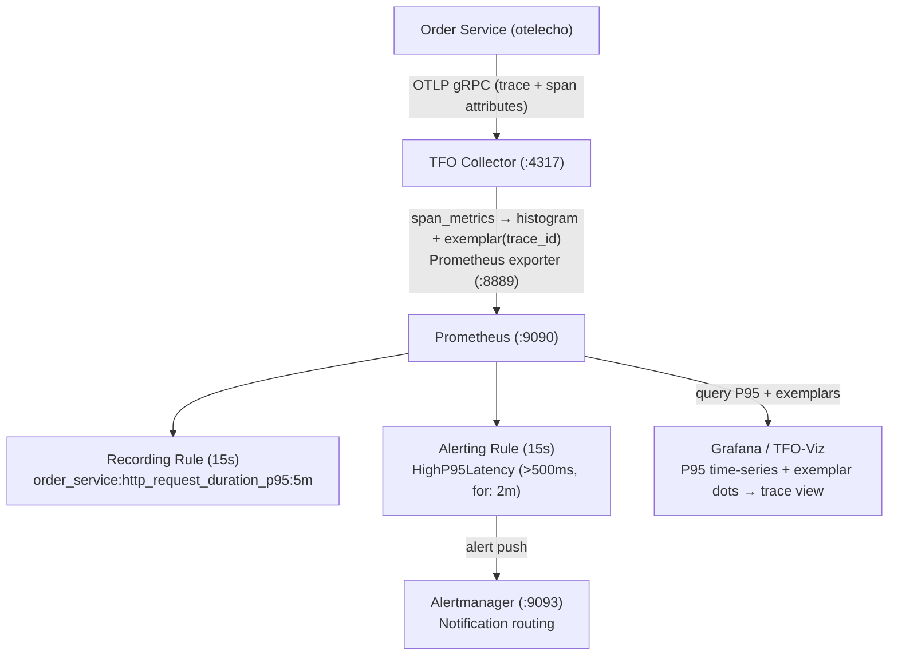
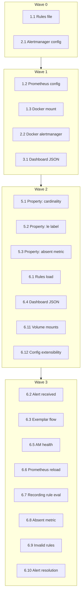

# Technical Summary: POST Orders Observability

## Executive Summary

This spec implements **P95 latency monitoring, alerting, and exemplar-based trace drill-down** for the `POST /api/v1/orders` endpoint (extensible to all endpoints). All deliverables are infrastructure configuration — no application code changes are needed since `otelecho` auto-instrumentation is already in place.

---

## Scope and Objectives

| Aspect                       | Detail                                                                                            |
| ---------------------------- | ------------------------------------------------------------------------------------------------- |
| **Target Endpoint**          | `POST /api/v1/orders` (extensible to all instrumented endpoints)                                  |
| **Primary Goal**             | Monitor P95 latency, alert on degradation, enable drill-down from metrics to traces via exemplars |
| **Application Code Changes** | None — otelecho already instruments all HTTP handlers                                             |
| **Deliverable Type**         | YAML/JSON configuration files + Docker Compose changes + test suite                               |

---

## Architecture — Data Flow



---

## Deliverables (Files Created/Modified)

### New Files

| File                                                | Purpose                                               |
| --------------------------------------------------- | ----------------------------------------------------- |
| `configs/prometheus/rules/order_service.yml`        | Recording rule (P95) + Alerting rule (HighP95Latency) |
| `configs/alertmanager/alertmanager.yml`             | Alert routing config with extensible receivers        |
| `configs/grafana/dashboards/order_service_p95.json` | Grafana dashboard JSON (P95 + exemplar drill-down)    |

### Modified Files

| File                                | Changes                                                                           |
| ----------------------------------- | --------------------------------------------------------------------------------- |
| `configs/prometheus/prometheus.yml` | Added `rule_files` directive + `alerting.alertmanagers` section                   |
| `docker-compose.yml`                | Added `alertmanager` service, mounted `configs/prometheus/rules/` into Prometheus |

---

## Key Configuration

### Recording Rule

```yaml
record: order_service:http_request_duration_p95:5m
expr: histogram_quantile(0.95, sum(rate(traces_span_metrics_duration_milliseconds_bucket[5m])) by (le, http_method, http_route))
interval: 15s
```

### Alerting Rule — HighP95Latency

| Parameter            | Value                                                       |
| -------------------- | ----------------------------------------------------------- |
| Threshold            | P95 > 500ms                                                 |
| Sustained Duration   | 2 minutes (8 evaluations @ 15s)                             |
| Severity             | WARNING                                                     |
| Suppression Window   | 30 minutes (`repeat_interval`)                              |
| Resolution Condition | Alert clears when P95 <= 500ms on the next evaluation cycle |

### Alertmanager Routing

- **Group by:** `alertname`, `http_method`, `http_route`
- **Group wait:** 30s
- **Receiver:** `default` (placeholder — add webhook/Slack/email by editing `alertmanager.yml` only)

### Grafana Dashboard

- **Datasource Variables:** `${DS_PROMETHEUS}`, `${DS_TRACES}` (Jaeger/Tempo)
- **Template Variable:** `http_route` (populated via `label_values()`)
- **Panel:** Time-series P95 with exemplar overlay
- **Exemplar Link:** Click dot → navigates to trace view via `trace_id`

---

## Cardinality Budget

```
Labels on traces_span_metrics_duration_milliseconds:
  http_method:      5 values  (GET, POST, PUT, PATCH, DELETE)
  http_status_code: 8 values  (200, 201, 400, 401, 403, 404, 422, 500)
  http_route:       6 values  (template-based routes)

Label combinations: 5 x 8 x 6 = 240
Histogram expansion: 240 x 14 (12 buckets + sum + count) = 3,360 raw series
Recording rule output: 5 x 6 = 30 series

Total: ~3,390 series (~3-10 MB memory)
```

> Justification for >1,000: This is inherent to histogram bucket expansion. The actual label cardinality is only 240.

---

## Retention Policy

| Signal     | Retention |
| ---------- | --------- |
| Metrics    | 90 days   |
| Traces     | 30 days   |
| Logs       | 30 days   |
| Exemplars  | 7 days    |
| Audit logs | 365 days  |

---

## Requirements Traceability

| ID  | Requirement                                | Status             |
| --- | ------------------------------------------ | ------------------ |
| R1  | P95 Latency Recording Rule                 | Implemented        |
| R2  | P95 Latency Alerting Rule                  | Implemented        |
| R3  | Alertmanager Deployment & Routing          | Implemented        |
| R4  | Exemplar End-to-End Flow Verification      | Verified via tests |
| R5  | Grafana Dashboard with Exemplar Drill-Down | Implemented        |
| R6  | Prometheus Rules File Integration          | Implemented        |

**Acceptance Criteria Coverage: 30/30 (100%)**

---

## Test Suite

### Property-Based Tests (`tests/unit/observability/`)

| File                     | Property Verified                                                    |
| ------------------------ | -------------------------------------------------------------------- |
| `cardinality_test.go`    | No metric label contains a UUID, trace_id (32-hex), or email address |
| `recording_rule_test.go` | Recording rule output excludes the `le` bucket label                 |
| `alert_rule_test.go`     | Absent metric does not trigger an alert                              |

### Unit/Validation Tests (`tests/unit/observability/`)

| File                          | Validates                                                           |
| ----------------------------- | ------------------------------------------------------------------- |
| `dashboard_test.go`           | Dashboard JSON structure, datasource vars, exemplar config          |
| `docker_compose_test.go`      | Volume mounts include `:ro` suffix                                  |
| `alertmanager_config_test.go` | Config extensibility (add receivers without docker-compose changes) |
| `helpers_test.go`             | Shared test utilities                                               |

### Integration Tests (`tests/integration/observability/`)

| File                          | Scenario                                                     |
| ----------------------------- | ------------------------------------------------------------ |
| `rules_validation_test.go`    | Prometheus rules load correctly via promtool                 |
| `alertmanager_alert_test.go`  | Alert received by Alertmanager after threshold exceeded      |
| `exemplar_flow_test.go`       | Exemplar end-to-end: trace → collector → Prometheus API      |
| `alertmanager_smoke_test.go`  | Container health check (`/-/healthy` → 200)                  |
| `prometheus_reload_test.go`   | Hot-reload via `/-/reload` POST                              |
| `recording_rule_eval_test.go` | P95 value appears within 30s of traffic                      |
| `absent_metric_test.go`       | Absent histogram → no series (no false positives)            |
| `invalid_rules_test.go`       | Invalid YAML → reject reload, return non-2xx                 |
| `alert_resolution_test.go`    | Alert fires → annotations correct → resolves below threshold |

---

## Docker Compose — New Service

```yaml
alertmanager:
  image: prom/alertmanager:v0.28.1
  profiles: ["monitoring", "all"]
  ports: 9093:9093
  network: 172.152.152.55
  healthcheck: /-/healthy
  volume: configs/alertmanager/alertmanager.yml (read-only)
```

---

## Usage

```bash
# Start monitoring stack (includes alertmanager)
docker compose --profile monitoring up -d

# Or start all services
docker compose --profile all up -d

# Verify rules are loaded
curl http://localhost:9090/api/v1/rules | jq '.data.groups[].name'

# Verify alertmanager health
curl http://localhost:9093/-/healthy

# Verify exemplars (after traffic has been generated)
curl "http://localhost:9090/api/v1/query_exemplars?query=traces_span_metrics_duration_milliseconds_bucket&start=$(date -v-1H +%s)&end=$(date +%s)" | jq '.data'

# Run unit tests
go test ./tests/unit/observability/... -v

# Run integration tests
go test ./tests/integration/observability/... -v -tags=integration
```

---

## Key Design Decisions

1. **Uses existing collector metric names** — `traces_span_metrics_duration_milliseconds` (underscores, ms) rather than `http.server.request.duration` (dots, seconds). Reason: the collector is a pre-existing shared component; renaming risks breaking changes.

2. **Exemplar storage limited to 7 days** — Prometheus uses a circular buffer. For longer investigation windows, query the trace backend directly.

3. **Alert threshold of 500ms lands on a histogram bucket boundary** — This ensures `histogram_quantile` is precise at the threshold without interpolation between buckets.

4. **No vendor-specific SDK** — All telemetry flows via standard OTLP to the TFO Collector using `TELEMETRYFLOW_ENDPOINT`.

5. **Forbidden labels enforced** — `order_id`, `customer_id`, `user_id`, `session_id`, `trace_id`, `span_id`, `request_id`, email addresses, IP addresses, and UUIDs never become metric labels. They may only appear as span attributes.

---

## Task Dependency Graph



---

## Status

**COMPLETED** — All 7 task groups finished. 30/30 acceptance criteria covered (100%), exceeding the 95% target.
