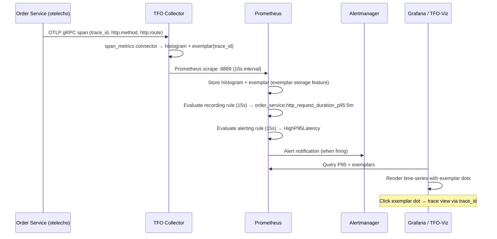
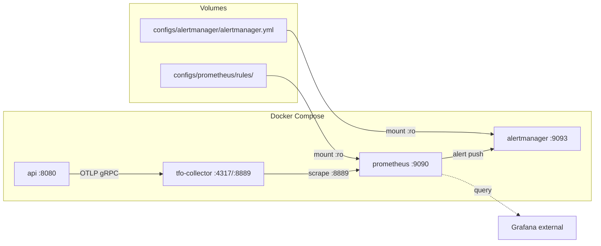

# Design Document: POST Orders Observability

## Overview

This design adds P95 latency monitoring, alerting, and exemplar-based trace drill-down for the `POST /api/v1/orders` endpoint (extensible to all instrumented endpoints). The existing infrastructure already provides span metrics with exemplars via the TFO Collector and Prometheus with exemplar-storage enabled. This design fills the gaps: Prometheus recording/alerting rules, Alertmanager deployment, Grafana dashboard provisioning, and end-to-end exemplar verification.

### Key Design Decisions

1. **Work with existing collector output** — The span_metrics connector emits `traces_span_metrics_duration_milliseconds` (underscore-separated, milliseconds). The steering file prescribes `http.server.request.duration` (dot-separated, seconds). Since the collector is a pre-existing shared component, we do NOT rename its output. Instead, the design documents the mapping and uses the actual metric name in all queries and rules.
2. **Alertmanager as sidecar** — Deployed via Docker Compose with the `monitoring` and `all` profiles. Configuration lives in version-controlled YAML.
3. **Grafana dashboard as JSON export** — No Grafana container in docker-compose (TFO-Viz handles visualization). We provide a portable JSON file for import into any Grafana instance.
4. **Rules in a dedicated directory** — `configs/prometheus/rules/*.yml` mounted read-only into Prometheus, enabling hot-reload via `/-/reload`.

---

## Architecture

### Exemplar Flow



### Infrastructure Topology



---

## Components and Interfaces

| Component                                           | Responsibility                            | New/Modified |
| --------------------------------------------------- | ----------------------------------------- | ------------ |
| `configs/prometheus/rules/order_service.yml`        | Recording + alerting rules                | **New**      |
| `configs/alertmanager/alertmanager.yml`             | Alert routing config                      | **New**      |
| `configs/prometheus/prometheus.yml`                 | Add `rule_files` + `alerting` section     | **Modified** |
| `docker-compose.yml`                                | Add Alertmanager service, mount rules dir | **Modified** |
| `configs/grafana/dashboards/order_service_p95.json` | Grafana dashboard JSON                    | **New**      |

---

## Data Models

### Metric Schema Table

| Metric Name                                  | Type                          | Unit | Allowed Labels                                  | Forbidden Labels                                                                                                                 |
| -------------------------------------------- | ----------------------------- | ---- | ----------------------------------------------- | -------------------------------------------------------------------------------------------------------------------------------- |
| `traces_span_metrics_duration_milliseconds`  | Histogram                     | ms   | `http_method`, `http_route`, `http_status_code` | `order_id`, `customer_id`, `user_id`, `session_id`, `trace_id`, `span_id`, `request_id`, email, IP, UUIDs, timestamps, free-text |
| `order_service:http_request_duration_p95:5m` | Gauge (recording rule output) | ms   | `http_method`, `http_route`                     | Same as above                                                                                                                    |

#### Naming Mapping (Steering ↔ Collector Reality)

| Steering Convention                            | Actual Collector Output                                       | Reason                                                                                                           |
| ---------------------------------------------- | ------------------------------------------------------------- | ---------------------------------------------------------------------------------------------------------------- |
| `http.server.request.duration` (dots, seconds) | `traces_span_metrics_duration_milliseconds` (underscores, ms) | Prometheus exposition format from span_metrics connector converts dots→underscores and uses explicit unit suffix |
| `http.request.method`                          | `http_method`                                                 | span_metrics `dimensions` config uses `http.method` which becomes `http_method` in Prometheus                    |
| `http.response.status_code`                    | `http_status_code`                                            | Same dimension mapping                                                                                           |
| `http.route`                                   | `http_route`                                                  | Same dimension mapping                                                                                           |

> **Note:** The metric labels in Prometheus use underscores because the Prometheus exposition format does not support dots. The collector's `span_metrics` connector maps span attribute names (`http.method`) to Prometheus label names (`http_method`). The semantic meaning is identical; only the serialization format differs.

### Cardinality Budget

```
Dimensions on traces_span_metrics_duration_milliseconds:

  http_method:      ~5 distinct (GET, POST, PUT, PATCH, DELETE)
  http_status_code: ~8 distinct (200, 201, 400, 401, 403, 404, 422, 500)
  http_route:       ~6 distinct (/api/v1/orders, /api/v1/orders/{id},
                                  /api/v1/orders/{id}/items, /health, /ready, /)

Cardinality = 5 × 8 × 6 = 240 series (histogram has ~12 buckets + sum + count)
Total time series = 240 × 14 = 3,360 raw series

Recording rule output (order_service:http_request_duration_p95:5m):
  http_method × http_route = 5 × 6 = 30 series

Total projected series: 3,390
```

**Justification for >1,000 series:** The 3,360 raw histogram series arise from the standard `le` bucket expansion (14 series per label combination × 240 combinations). This is an inherent property of histograms with 12 explicit buckets. The actual label cardinality is only 240 — well within safe bounds. Each series consumes ~1-3 KB in Prometheus TSDB; total memory overhead is ~3-10 MB, negligible for a single-service deployment.

### Histogram Bucket Bounds

The span_metrics connector is already configured with these buckets (in the collector config):

```
[1ms, 5ms, 10ms, 25ms, 50ms, 100ms, 250ms, 500ms, 1s, 2.5s, 5s, 10s]
```

**Alert threshold alignment:** The P95 alert threshold is 500ms, which lands exactly on the `500ms` bucket boundary. This means `histogram_quantile(0.95, ...)` will produce precise values at the alert threshold rather than interpolating between buckets.

---

## Retention Policy

| Signal         | Retention | Notes                                          |
| -------------- | --------- | ---------------------------------------------- |
| Metrics (TSDB) | 90 days   | Prometheus default storage.tsdb.retention.time |
| Traces         | 30 days   | Stored in TFO backend (ClickHouse)             |
| Logs           | 30 days   | Stored in TFO backend (ClickHouse)             |
| Exemplars      | 7 days    | Prometheus exemplar-storage circular buffer    |
| Audit logs     | 365 days  | N/A for this feature                           |

---

## TFQL / PromQL Query Templates

### Dashboard Panel: P95 Latency Time Series

```promql
# Panel: P95 Latency by Route
order_service:http_request_duration_p95:5m{http_route="$http_route"}
```

### Dashboard Panel: Exemplar Overlay (raw histogram)

```promql
# Exemplar query — uses raw histogram, not recording rule
# Grafana fetches exemplars from this series automatically when exemplar toggle is ON
traces_span_metrics_duration_milliseconds_bucket{http_route="$http_route"}
```

### Alert Evaluation Query

```promql
# Alert: HighP95Latency
# Fires when P95 latency exceeds 500ms for 2 minutes
order_service:http_request_duration_p95:5m > 500
```

### Recording Rule Query

```promql
# Recording rule expression
histogram_quantile(0.95,
  sum(rate(traces_span_metrics_duration_milliseconds_bucket[5m])) by (le, http_method, http_route)
)
```

### Exemplar API Verification Query

```promql
# Verify exemplars via Prometheus API
# GET /api/v1/query_exemplars?query=traces_span_metrics_duration_milliseconds_bucket&start=<start>&end=<end>
traces_span_metrics_duration_milliseconds_bucket{http_method="POST", http_route="/api/v1/orders"}
```

---

## Alert Rule Definitions

### Alert: HighP95Latency

| Field                    | Value                                                                                                                                                |
| ------------------------ | ---------------------------------------------------------------------------------------------------------------------------------------------------- |
| **Threshold**            | P95 > 500 ms                                                                                                                                         |
| **Sustained duration**   | 2 minutes (8 consecutive evaluations at 15s interval)                                                                                                |
| **Severity**             | WARNING                                                                                                                                              |
| **Suppression window**   | 30 minutes                                                                                                                                           |
| **Resolution condition** | Alert resolves when `order_service:http_request_duration_p95:5m` ≤ 500 for one full evaluation cycle (alert transitions from `firing` to `inactive`) |

**Annotations:**

```yaml
annotations:
  summary: 'P95 latency {{ $value | printf "%.0f" }}ms on {{ $labels.http_method }} {{ $labels.http_route }}'
  requirement_id: "R2"
```

**Labels:**

```yaml
labels:
  severity: warning
  http_method: "{{ $labels.http_method }}"
  http_route: "{{ $labels.http_route }}"
```

---

## Error Handling

| Scenario                         | Handling                                                                                                       |
| -------------------------------- | -------------------------------------------------------------------------------------------------------------- |
| Rules file contains invalid YAML | Prometheus rejects reload, returns non-2xx on `/-/reload`, continues with previous rules                       |
| Rules file not mounted           | Prometheus logs warning about missing file glob match, starts without rules                                    |
| Alertmanager unreachable         | Prometheus logs connection errors, retries on next evaluation cycle; alerts still visible in Prometheus UI     |
| No traffic (absent metric)       | Recording rule produces no series (NaN/absent); alerting rule treats absent as not-satisfied → no false alerts |
| Exemplar buffer full             | Oldest exemplars evicted (circular buffer); 7-day retention configured                                         |
| Collector restart                | Prometheus scrape returns empty; next scrape picks up new data; brief gap in metrics (≤10s)                    |

---

## Testing Strategy

### Testing Approach

This feature is primarily **infrastructure configuration** (Prometheus rules, Alertmanager deployment, Docker Compose, Grafana dashboard JSON). The core deliverables are YAML/JSON configuration files, not functions with input/output behavior. Therefore:

- **Property-based testing** applies to one specific concern from the steering file: verifying that no metric label matches a UUID/high-cardinality pattern. This is a universal property that should hold across all metric samples regardless of input.
- **Integration tests** verify the end-to-end pipeline: rules load correctly, exemplars flow, alerts fire.
- **Unit tests** (example-based) verify specific configurations are correct (rule syntax, dashboard JSON structure).

### Property-Based Test

**Library:** [rapid](https://github.com/flyingmutant/rapid) (Go property-based testing)

**Test:** Generate random metric label sets and verify none contain UUID-shaped values, trace IDs, or other forbidden high-cardinality patterns.

- Minimum 100 iterations
- Tag: **Feature: post-orders-observability, Property 1: No metric label contains a UUID or high-cardinality identifier**

### Integration Tests

1. **Rules load test** — Start Prometheus with rules file, verify `/api/v1/rules` returns `order_service_latency` group (validates R1, R6)
2. **Alert fires test** — Inject histogram samples above threshold, wait 2 min, verify alert state=firing (validates R2)
3. **Exemplar flow test** — Send a trace to collector, scrape, query `/api/v1/query_exemplars`, verify trace_id present (validates R4)
4. **Alertmanager routing test** — Verify Alertmanager receives fired alert via its API (validates R3)
5. **Dashboard JSON validation** — Load JSON, verify datasource variables, panel queries, exemplar config (validates R5)

### Smoke Tests

1. **Alertmanager health** — Container starts, `/-/healthy` returns 200 (validates R3.1)
2. **Prometheus reload** — POST `/-/reload` after rules mount, verify 200 response (validates R6.3)

---

## Correctness Properties

_A property is a characteristic or behavior that should hold true across all valid executions of a system — essentially, a formal statement about what the system should do. Properties serve as the bridge between human-readable specifications and machine-verifiable correctness guarantees._

### Property 1: No metric label contains a high-cardinality identifier

_For any_ metric sample scraped from the collector's Prometheus endpoint, none of the label values SHALL match a UUID pattern (`[0-9a-f]{8}-[0-9a-f]{4}-[0-9a-f]{4}-[0-9a-f]{4}-[0-9a-f]{12}`), a 32-character hex string (trace_id/span_id format), or contain an `@` character (email pattern).

**Validates: Requirements 1.2 (label restrictions), Steering §2 (Cardinality hard constraints)**

### Property 2: Recording rule output excludes the `le` bucket label

_For any_ time series produced by the `order_service:http_request_duration_p95:5m` recording rule, the label set SHALL contain `http_method` and `http_route` but SHALL NOT contain the `le` label.

**Validates: Requirements 1.2**

### Property 3: Absent source metric produces no alert

_For any_ `http_method` and `http_route` label combination where the source histogram `traces_span_metrics_duration_milliseconds_bucket` has zero samples in the rate window, the `HighP95Latency` alert SHALL remain inactive (not pending, not firing).

**Validates: Requirements 2.5**
