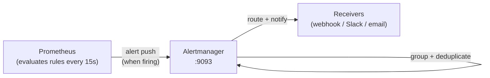
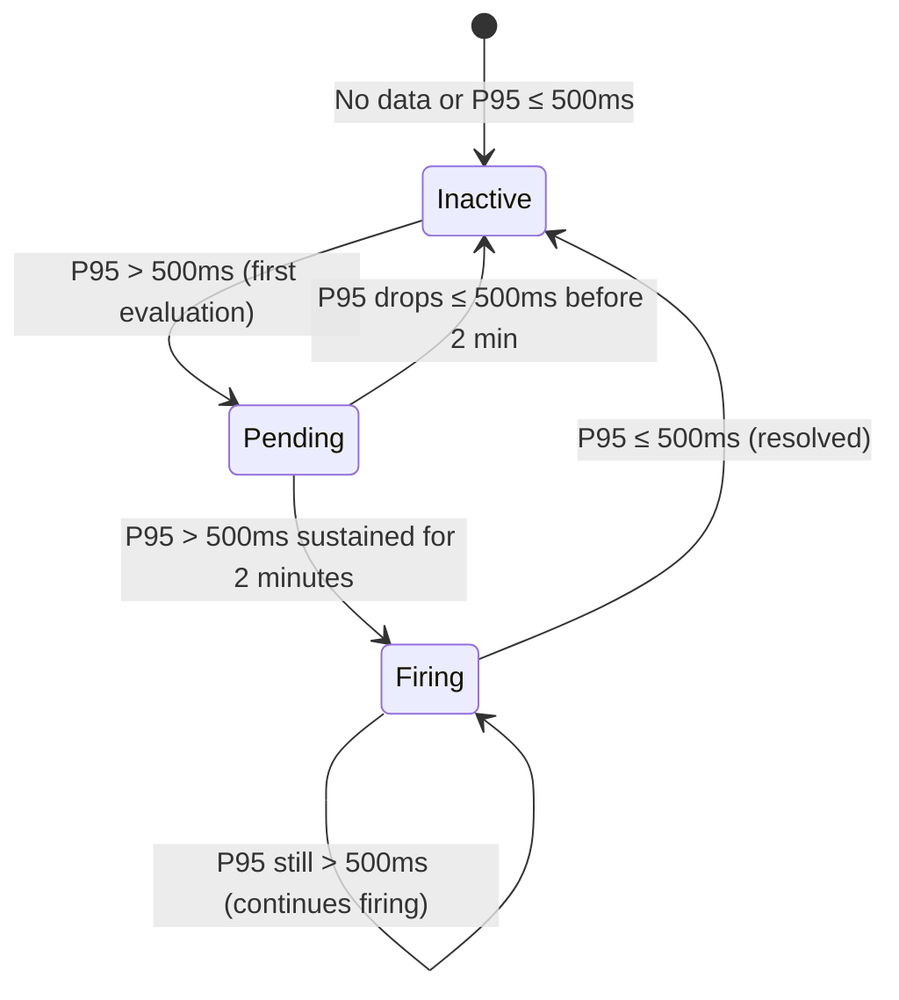

# Alerting

This document covers Prometheus alerting rules, Alertmanager configuration, routing strategy, and on-call runbooks for the Order Service.

---

## Overview

Alerting is powered by **Prometheus alerting rules** that evaluate pre-computed recording rules, with notifications routed through **Alertmanager**. The architecture separates metric evaluation (Prometheus) from notification delivery (Alertmanager).



---

## Alert Rules

### HighP95Latency

| Field                    | Value                                                      |
| ------------------------ | ---------------------------------------------------------- |
| **Expression**           | `order_service:http_request_duration_p95:5m > 500`         |
| **Threshold**            | P95 latency > 500ms                                        |
| **Sustained Duration**   | 2 minutes (8 consecutive evaluations at 15s interval)      |
| **Severity**             | WARNING                                                    |
| **Suppression Window**   | 30 minutes (`repeat_interval`)                             |
| **Resolution Condition** | Alert clears when P95 ≤ 500ms on the next evaluation cycle |

**Rule Definition** (`configs/prometheus/rules/order_service.yml`):

```yaml
groups:
  - name: order_service_latency
    interval: 15s
    rules:
      - record: order_service:http_request_duration_p95:5m
        expr: >
          histogram_quantile(0.95,
            sum(rate(traces_span_metrics_duration_milliseconds_bucket[5m]))
            by (le, http_method, http_route))

      - alert: HighP95Latency
        expr: order_service:http_request_duration_p95:5m > 500
        for: 2m
        labels:
          severity: warning
        annotations:
          summary: 'P95 latency {{ $value | printf "%.0f" }}ms on {{ $labels.http_method }} {{ $labels.http_route }}'
          requirement_id: "R2"
```

### Alert Lifecycle



---

## Recording Rules

Recording rules pre-compute expensive queries so dashboards and alerts evaluate instantly:

| Rule        | Expression                                                                      | Output Metric                                |
| ----------- | ------------------------------------------------------------------------------- | -------------------------------------------- |
| P95 Latency | `histogram_quantile(0.95, sum(rate(...[5m])) by (le, http_method, http_route))` | `order_service:http_request_duration_p95:5m` |

The recording rule:

- Evaluates every 15 seconds
- Produces one time series per unique `http_method` + `http_route` combination
- Excludes the `le` (bucket boundary) label from output
- Produces no series when there is no traffic (avoids false zeros)

---

## Alertmanager Configuration

**File:** `configs/alertmanager/alertmanager.yml`

```yaml
global:
  resolve_timeout: 5m

route:
  receiver: "default"
  group_by: ["alertname", "http_method", "http_route"]
  group_wait: 30s
  group_interval: 5m
  repeat_interval: 30m

receivers:
  - name: "default"
    webhook_configs: []
```

### Routing Parameters

| Parameter         | Value                                    | Purpose                                                         |
| ----------------- | ---------------------------------------- | --------------------------------------------------------------- |
| `group_by`        | `alertname`, `http_method`, `http_route` | Group related alerts together                                   |
| `group_wait`      | 30s                                      | Wait before sending first notification (allows grouping)        |
| `group_interval`  | 5m                                       | Minimum interval between notifications for same group           |
| `repeat_interval` | 30m                                      | Re-notify interval for still-firing alerts (suppression window) |
| `resolve_timeout` | 5m                                       | Mark alert resolved if no update received within this time      |

### Adding Receivers

To add a notification channel, edit `configs/alertmanager/alertmanager.yml` only — no Docker Compose or Prometheus changes needed:

**Slack example:**

```yaml
receivers:
  - name: "default"
    slack_configs:
      - api_url: "https://hooks.slack.com/services/YOUR/WEBHOOK/URL"
        channel: "#alerts"
        title: "{{ .GroupLabels.alertname }}"
        text: "{{ range .Alerts }}{{ .Annotations.summary }}{{ end }}"
```

**Webhook example:**

```yaml
receivers:
  - name: "default"
    webhook_configs:
      - url: "http://your-webhook-endpoint:5001/alerts"
        send_resolved: true
```

After editing, reload Alertmanager:

```bash
curl -X POST http://localhost:9093/-/reload
```

---

## Alert Design Principles

1. **No alert fires from a single sample** — The `for: 2m` clause requires 8 consecutive evaluations before firing.
2. **Every alert is actionable** — If the on-call engineer cannot act on it at 3am, it belongs on a dashboard, not in an alert.
3. **Alerts carry context** — The `summary` annotation includes the observed value and affected endpoint.
4. **Absent metrics do not trigger alerts** — When there is no traffic, the recording rule produces no series, and the alert stays inactive.

---

## Prometheus Alerting Integration

Prometheus is configured to send alerts to Alertmanager:

```yaml
# In configs/prometheus/prometheus.yml
alerting:
  alertmanagers:
    - static_configs:
        - targets: ["alertmanager:9093"]
```

---

## Verifying Alerts

```bash
# Check alert rules are loaded
curl http://localhost:9090/api/v1/rules | jq '.data.groups[] | select(.name == "order_service_latency")'

# Check current alert state
curl http://localhost:9090/api/v1/alerts | jq '.data.alerts[]'

# Check Alertmanager received alerts
curl http://localhost:9093/api/v2/alerts | jq '.'

# Check Alertmanager status
curl http://localhost:9093/-/healthy
```

---

## On-Call Runbook: HighP95Latency

### What Triggered

P95 request latency exceeded 500ms for 2+ minutes on one or more endpoints.

### Investigation Steps

1. **Check the affected endpoint** — Read `http_method` and `http_route` from the alert labels
2. **Open Grafana dashboard** — Look at the P95 Latency panel for the affected route
3. **Click exemplar dots** — Navigate to slow traces to identify the root cause
4. **Check database performance** — Slow queries are the most common cause
5. **Check external dependencies** — Network timeouts to downstream services
6. **Check resource utilization** — CPU, memory, connection pool saturation

### Common Causes

| Cause                      | Diagnosis                             | Resolution                              |
| -------------------------- | ------------------------------------- | --------------------------------------- |
| Slow database queries      | Trace shows long DB span              | Add index, optimize query               |
| Connection pool exhaustion | Many spans waiting for connection     | Increase `DB_MAX_OPEN_CONNS`            |
| High traffic spike         | Request count increased sharply       | Scale horizontally or add rate limiting |
| Downstream timeout         | Trace shows external call timeout     | Check downstream service health         |
| GC pressure                | Frequent GC pauses visible in metrics | Profile memory, reduce allocations      |

### Resolution

Once the root cause is addressed:

- The recording rule will reflect lower P95 values within 15 seconds
- The alert will resolve automatically once P95 ≤ 500ms

---

## Related Pages

- [Observability](Observability.md) — Telemetry pipeline and metrics schema
- [Grafana Dashboards](Grafana-Dashboards.md) — P95 panels with exemplar drill-down
- [Troubleshooting](Troubleshooting.md) — Common issues and resolution steps
