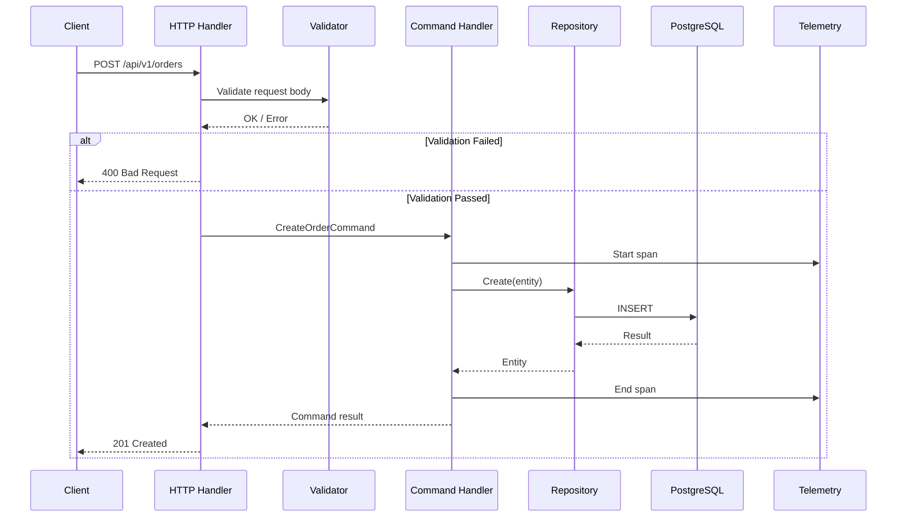
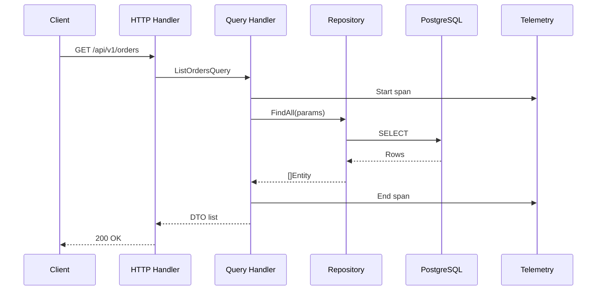
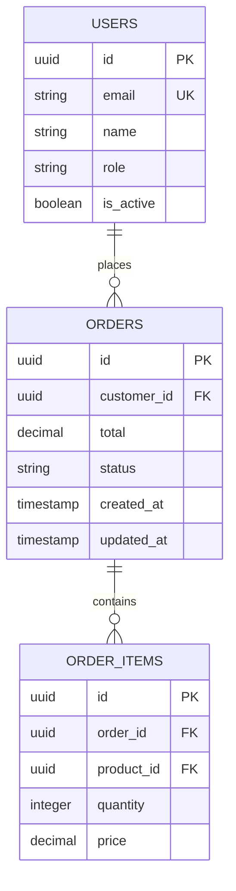
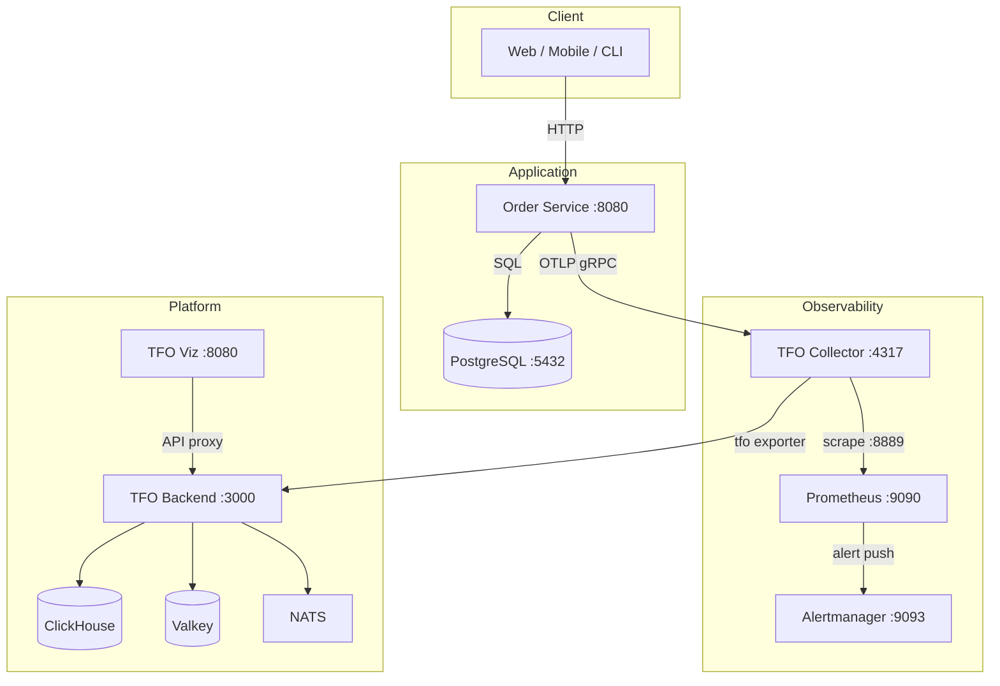

# Architecture

This document describes the system architecture of the Order Service, covering application layers, design patterns, infrastructure topology, and data flow.

---

## Design Philosophy

The Order Service follows two core architectural patterns:

- **Domain-Driven Design (DDD)** — Isolates business logic in a domain layer with clearly defined entities, value objects, and repository interfaces.
- **CQRS (Command Query Responsibility Segregation)** — Separates write operations (commands) from read operations (queries), enabling independent optimization of each path.

---

## Layered Architecture

```mermaid
block-beta
    columns 1
    block:presentation["Presentation Layer\n(HTTP Handlers, Middleware, Routing)"]
    end
    block:application["Application Layer\n(Command Handlers, Query Handlers, DTOs)"]
    end
    block:domain["Domain Layer\n(Entities, Repository Interfaces)"]
    end
    block:infrastructure["Infrastructure Layer\n(Persistence, Config, Telemetry, External Services)"]
    end

    presentation --> application
    application --> domain
    domain --> infrastructure
```

### Layer Responsibilities

| Layer              | Location                        | Responsibility                                                                                |
| ------------------ | ------------------------------- | --------------------------------------------------------------------------------------------- |
| **Presentation**   | `internal/infrastructure/http/` | HTTP request parsing, validation, response formatting, middleware (auth, rate limiting, CORS) |
| **Application**    | `internal/application/`         | Orchestrate use cases via command/query handlers; no business logic                           |
| **Domain**         | `internal/domain/`              | Core business rules, entities, repository contracts                                           |
| **Infrastructure** | `internal/infrastructure/`      | Database access, configuration loading, telemetry setup                                       |

---

## CQRS Flow

### Command Path (Write Operations)



### Query Path (Read Operations)



---

## Domain Model



Order statuses: `pending` → `confirmed` → `processing` → `shipped` → `delivered` | `cancelled`

For full schema details, see the [Entity Relationship Diagram](../diagrams/ERD.md).

---

## Infrastructure Topology



### Service Inventory

| Service           | Image                                         | Port(s)                 | Profile(s)                 |
| ----------------- | --------------------------------------------- | ----------------------- | -------------------------- |
| Order Service API | Custom (Dockerfile)                           | 8080                    | `app`, `all`               |
| PostgreSQL        | `postgres:18-alpine`                          | 5432                    | `db`, `app`, `all`         |
| TFO Collector     | `telemetryflow/telemetryflow-collector:1.3.0` | 4317, 4318, 8889, 13133 | `app`, `monitoring`, `all` |
| Prometheus        | `prom/prometheus:v3.13.2`                     | 9090                    | `monitoring`, `all`        |
| Alertmanager      | `prom/alertmanager:v0.33.1`                   | 9093                    | `monitoring`, `all`        |
| Loki              | `grafana/loki:3.7.4`                          | 3100                    | `monitoring`, `all`        |
| Jaeger            | `jaegertracing/all-in-one:1.76.0`             | 16686                   | `monitoring`, `all`        |
| Grafana           | `grafana/grafana:13.1.1`                      | 3001                    | `monitoring`, `all`        |
| TFO Backend       | `telemetryflow/telemetryflow-platform:1.4.4`  | 3000                    | `platform`                 |
| TFO Viz           | `telemetryflow/telemetryflow-viz:1.4.4`       | 80                      | `platform`                 |
| ClickHouse        | `clickhouse/clickhouse-server:26.7-alpine`    | 8123, 9000              | `platform`                 |
| Valkey            | `valkey/valkey:8-alpine`                      | 6379                    | `platform`                 |
| NATS              | `nats:2.14-alpine`                            | 4222, 8222              | `platform`                 |

---

## Networking

All containers run on a shared Docker bridge network:

| Property     | Value               |
| ------------ | ------------------- |
| Network name | `order_service_net` |
| Subnet       | `172.152.0.0/16`    |
| Driver       | `bridge`            |

Static IP assignments ensure deterministic service discovery within the compose stack. See [Docker Compose](Docker-Compose.md) for full network configuration.

---

## Telemetry Architecture

The service uses **OpenTelemetry** for all three telemetry signals:

| Signal      | Instrumentation                                      | Export Path                                    |
| ----------- | ---------------------------------------------------- | ---------------------------------------------- |
| **Traces**  | `otelecho` middleware (auto)                         | App → OTLP gRPC → TFO Collector → TFO Platform |
| **Metrics** | Span-derived histograms via `span_metrics` connector | Collector → Prometheus scrape (:8889)          |
| **Logs**    | Structured JSON (`LOG_FORMAT=json`)                  | App → OTLP → Collector → TFO Platform          |

### Exemplar Flow

Traces generate metrics with exemplars, enabling click-through from metric observations to the originating trace:

1. Application emits trace span with `trace_id`
2. Collector's `span_metrics` connector derives histogram metric + attaches exemplar with `trace_id`
3. Prometheus scrapes the histogram with exemplar data
4. Grafana renders exemplar dots on time-series panels
5. Clicking a dot navigates to the trace in Jaeger/Tempo

For details, see [Observability](Observability.md).

---

## Security Boundaries

| Boundary           | Mechanism                                         |
| ------------------ | ------------------------------------------------- |
| API Authentication | JWT Bearer tokens (HS256)                         |
| Rate Limiting      | Per-IP token bucket (configurable)                |
| Database Access    | Connection pooling with credentials from env vars |
| Telemetry Auth     | TFO API key (v2 endpoints); v1 endpoints are open |
| Container Network  | Isolated bridge network, no host-mode ports       |

---

## Configuration Strategy

Configuration is loaded from environment variables (12-factor app). In development, a `.env` file provides defaults. In production, secrets are injected via the orchestrator.

Key configuration categories:

- **Server** — Port, timeouts
- **Database** — Connection string, pool sizes
- **JWT** — Signing keys, expiration
- **Telemetry** — Collector endpoint, service name/version
- **Rate Limiting** — Request count, window

See the [README](../../README.md) for the full environment variable reference.

---

## Related Pages

- [Observability](Observability.md) — Metrics, traces, exemplars pipeline
- [Docker Compose](Docker-Compose.md) — Deployment profiles and configuration
- [Data Flow Diagram](../diagrams/DFD.md) — Detailed data flow at each layer
