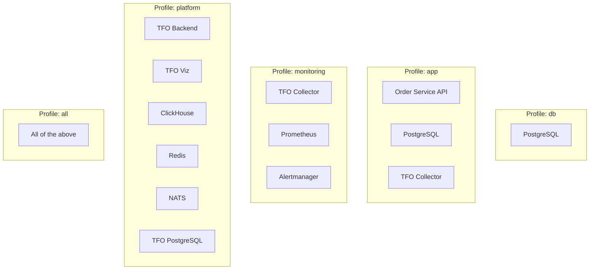
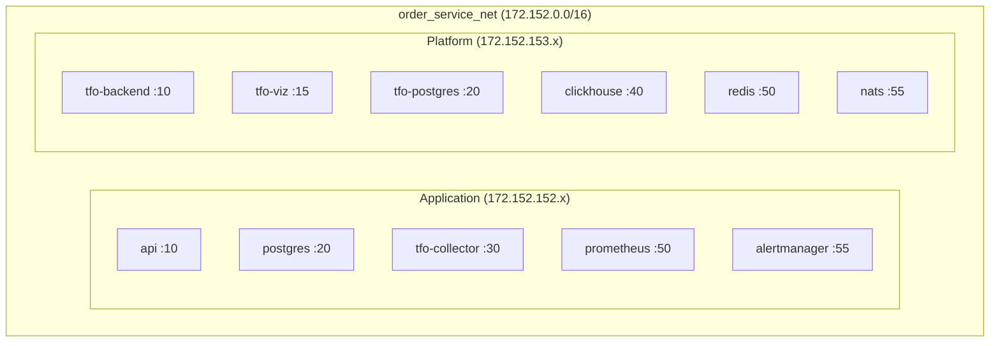
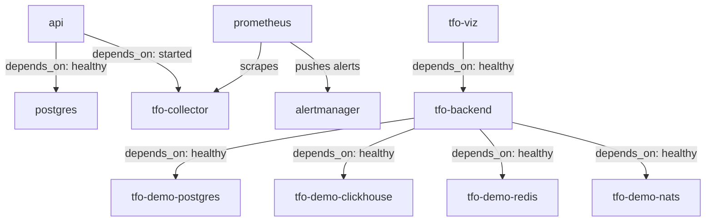

# Docker Compose

This document covers the Docker Compose deployment configuration, service profiles, networking, volume mounts, and operational procedures for the Order Service stack.

---

## Overview

The Order Service uses a single `docker-compose.yml` with **profile-based deployment** to support multiple operational modes — from minimal local development to full platform with monitoring.

---

## Profiles



| Profile      | Services                                                   | Use Case                                                 |
| ------------ | ---------------------------------------------------------- | -------------------------------------------------------- |
| `db`         | PostgreSQL                                                 | Database-only for migrations or external app development |
| `app`        | API + PostgreSQL + TFO Collector                           | Application development with telemetry export            |
| `monitoring` | TFO Collector + Prometheus + Alertmanager                  | Observability stack (no application)                     |
| `platform`   | TFO Backend + Viz + ClickHouse + Redis + NATS + PostgreSQL | Full TFO Platform                                        |
| `all`        | Everything above combined                                  | Complete local environment                               |

### Usage

```bash
# Database only
docker compose --profile db up -d

# Application + telemetry
docker compose --profile app up -d

# Monitoring stack
docker compose --profile monitoring up -d

# Full platform
docker compose --profile platform up -d

# Everything
docker compose --profile all up -d

# Rebuild after code changes
docker compose --profile app up -d --build api

# Stop all
docker compose --profile all down
```

---

## Services

### Application Services

| Service    | Image                | Port(s) | Static IP      | Profiles     |
| ---------- | -------------------- | ------- | -------------- | ------------ |
| `postgres` | `postgres:16-alpine` | 5432    | 172.152.152.20 | db, app, all |
| `api`      | Custom (Dockerfile)  | 8080    | 172.152.152.10 | app, all     |

### Monitoring Services

| Service         | Image                                         | Port(s)                              | Static IP      | Profiles             |
| --------------- | --------------------------------------------- | ------------------------------------ | -------------- | -------------------- |
| `tfo-collector` | `telemetryflow/telemetryflow-collector:1.3.0` | 4317, 4318, 8889, 13133, 55679, 1777 | 172.152.152.30 | app, monitoring, all |
| `prometheus`    | `prom/prometheus:v3.4.0`                      | 9090                                 | 172.152.152.50 | monitoring, all      |
| `alertmanager`  | `prom/alertmanager:v0.28.1`                   | 9093                                 | 172.152.152.55 | monitoring, all      |

### Platform Services

| Service               | Image                                        | Port(s)    | Static IP      | Profiles |
| --------------------- | -------------------------------------------- | ---------- | -------------- | -------- |
| `tfo-demo-postgres`   | `postgres:16-alpine`                         | 5433       | 172.152.153.20 | platform |
| `tfo-demo-clickhouse` | `clickhouse/clickhouse-server:26.7`          | 8123, 9000 | 172.152.153.40 | platform |
| `tfo-demo-redis`      | `redis:7-alpine`                             | 6380       | 172.152.153.50 | platform |
| `tfo-demo-nats`       | `nats:2-alpine`                              | 4222, 8222 | 172.152.153.55 | platform |
| `tfo-backend`         | `telemetryflow/telemetryflow-platform:1.4.0` | 3000       | 172.152.153.10 | platform |
| `tfo-viz`             | `telemetryflow/telemetryflow-viz:1.4.0`      | 80         | 172.152.153.15 | platform |

---

## Networking

All containers share a single Docker bridge network:



| Property     | Value               |
| ------------ | ------------------- |
| Network name | `order_service_net` |
| Driver       | `bridge`            |
| Subnet       | `172.152.0.0/16`    |

Static IP assignments enable deterministic DNS-free service discovery within the compose stack.

---

## Volume Mounts

### Configuration Volumes (Read-Only)

| Service         | Host Path                                 | Container Path                          | Mode  |
| --------------- | ----------------------------------------- | --------------------------------------- | ----- |
| `tfo-collector` | `./configs/otel/tfo-collector.yaml`       | `/etc/tfo-collector/tfo-collector.yaml` | `:ro` |
| `prometheus`    | `./configs/prometheus/prometheus.yml`     | `/etc/prometheus/prometheus.yml`        | `:ro` |
| `prometheus`    | `./configs/prometheus/rules/`             | `/etc/prometheus/rules/`                | `:ro` |
| `alertmanager`  | `./configs/alertmanager/alertmanager.yml` | `/etc/alertmanager/alertmanager.yml`    | `:ro` |

### Data Volumes (Persistent)

| Service               | Volume                                     | Purpose             |
| --------------------- | ------------------------------------------ | ------------------- |
| `postgres`            | `${VOLUMES_BASE_PATH}/postgresql`          | Order database      |
| `prometheus`          | `vol_prometheus_data` (named)              | Metrics TSDB        |
| `tfo-demo-postgres`   | `${VOLUMES_BASE_PATH}/tfo-demo/postgresql` | Platform database   |
| `tfo-demo-clickhouse` | `${VOLUMES_BASE_PATH}/tfo-demo/clickhouse` | Time-series storage |
| `tfo-demo-redis`      | `${VOLUMES_BASE_PATH}/tfo-demo/redis`      | Cache + queues      |
| `tfo-demo-nats`       | `${VOLUMES_BASE_PATH}/tfo-demo/nats`       | Message store       |

---

## Health Checks

All services include health checks for dependency ordering:

| Service         | Check                                  | Interval | Start Period |
| --------------- | -------------------------------------- | -------- | ------------ |
| `postgres`      | `pg_isready`                           | 10s      | 10s          |
| `api`           | `wget http://localhost:8080/health`    | 30s      | 40s          |
| `tfo-collector` | `wget http://localhost:13133`          | 10s      | 10s          |
| `prometheus`    | `wget http://localhost:9090/-/healthy` | 10s      | 10s          |
| `alertmanager`  | `wget http://localhost:9093/-/healthy` | 10s      | 10s          |
| `tfo-backend`   | `wget http://localhost:3000/health`    | 30s      | 40s          |

---

## Prometheus Features

Prometheus is started with these feature flags:

```bash
--web.enable-lifecycle          # Hot-reload via POST /-/reload
--web.enable-remote-write-receiver  # Accept remote-write for testing
--enable-feature=exemplar-storage   # Store exemplars from histogram scrapes
--enable-feature=native-histograms  # Support native histogram format
```

### Hot-Reload Rules

After modifying files in `configs/prometheus/rules/`:

```bash
# Trigger reload (no container restart needed)
curl -X POST http://localhost:9090/-/reload

# Verify rules loaded
curl http://localhost:9090/api/v1/rules | jq '.data.groups[].name'
```

---

## Environment Variables

Key environment variables (configured via `.env` file):

| Variable                     | Default              | Description             |
| ---------------------------- | -------------------- | ----------------------- |
| `PORT`                       | `8080`               | API server port         |
| `DB_USER`                    | `postgres`           | PostgreSQL username     |
| `DB_PASSWORD`                | `password`           | PostgreSQL password     |
| `DB_NAME`                    | `orders`             | Database name           |
| `TELEMETRYFLOW_ENDPOINT`     | `tfo-collector:4317` | Collector gRPC endpoint |
| `TELEMETRYFLOW_SERVICE_NAME` | `Order-Service`      | OTel service name       |
| `PORT_PROMETHEUS`            | `9090`               | Prometheus host port    |
| `PORT_ALERTMANAGER`          | `9093`               | Alertmanager host port  |
| `LOG_LEVEL`                  | `info`               | Application log level   |

See `.env.example` for the complete list.

---

## Dependency Graph



---

## Common Operations

```bash
# View logs for a specific service
docker compose logs -f api

# Restart a single service
docker compose restart prometheus

# Scale (not applicable for static IPs, but useful for stateless services)
docker compose --profile app up -d --scale api=1

# Validate compose file
docker compose config

# Clean up everything (including volumes)
docker compose --profile all down -v
```

---

## Related Pages

- [Architecture](Architecture.md) — Infrastructure topology overview
- [Observability](Observability.md) — Telemetry pipeline configuration
- [Alerting](Alerting.md) — Alertmanager service and routing
