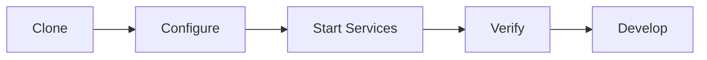
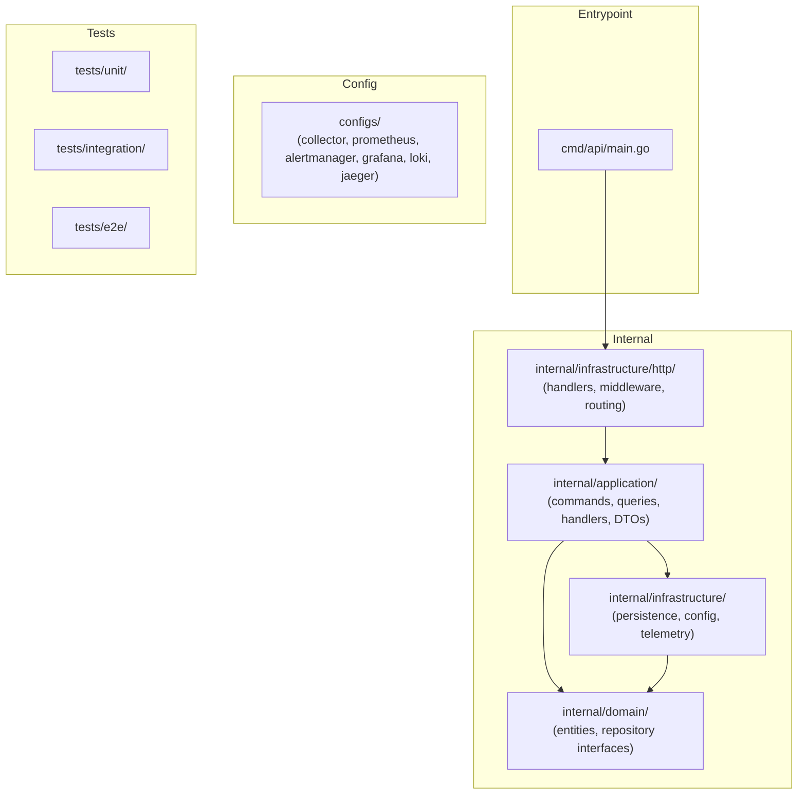

# Getting Started

This guide walks you through setting up the Order Service locally — from prerequisites to a fully running stack with observability.

---

## Prerequisites

| Tool           | Version | Purpose                       |
| -------------- | ------- | ----------------------------- |
| Go             | 1.26+   | Application build and test    |
| Docker         | 24+     | Container runtime             |
| Docker Compose | v2+     | Multi-container orchestration |
| Make           | any     | Build automation              |
| Git            | any     | Source control                |

### Optional Tools

| Tool            | Purpose                       | Install                                                                 |
| --------------- | ----------------------------- | ----------------------------------------------------------------------- |
| `air`           | Hot-reload during development | `go install github.com/cosmtrek/air@latest`                             |
| `golangci-lint` | Code linting                  | `go install github.com/golangci/golangci-lint/cmd/golangci-lint@latest` |
| `staticcheck`   | Static analysis               | `go install honnef.co/go/tools/cmd/staticcheck@latest`                  |
| `promtool`      | Prometheus rule validation    | Bundled with Prometheus Docker image                                    |

---

## Quick Start



### 1. Clone the Repository

```bash
git clone https://github.com/telemetryflow/order-service.git
cd order-service
```

### 2. Configure Environment

```bash
cp .env.example .env
```

Edit `.env` and set at minimum:

```bash
DB_PASSWORD=password              # PostgreSQL password
JWT_SECRET=your-secret-min-64     # JWT signing key (64+ chars recommended)
```

The defaults work for local development with Docker Compose.

### 3. Start Services

Choose a profile based on what you need:

```bash
# Database only (for running the API locally)
docker compose --profile db up -d

# Application + telemetry collector
docker compose --profile app up -d

# Monitoring stack (Prometheus + Alertmanager + Grafana + Jaeger + Loki)
docker compose --profile monitoring up -d

# Full TFO Platform (backend, viz, infra)
docker compose --profile platform up -d

# Everything
docker compose --profile all up -d
```

#### Rebuilding After Code Changes

When you modify application code, rebuild the API container:

```bash
# Rebuild and restart only the api service
docker compose --profile app up -d --build api

# Or rebuild everything in the profile
docker compose --profile app up -d --build
```

### 4. Verify

```bash
# API health
curl http://localhost:8080/health
# Expected: {"status":"ok"}

# Prometheus (if monitoring profile)
curl http://localhost:9090/-/healthy
# Expected: Prometheus Server is Ready.

# Alertmanager (if monitoring profile)
curl http://localhost:9093/-/healthy
# Expected: OK
```

---

## Running the API Locally (Without Docker)

If you prefer running the Go binary directly:

```bash
# 1. Start only the database
docker compose --profile db up -d

# 2. Download dependencies
go mod download

# 3. Build and run
make run

# Or with hot-reload (requires air)
make dev
```

The API starts on `http://localhost:8080`.

### Environment for Local Run

When running outside Docker, update these in `.env`:

```bash
DB_HOST=localhost       # (not 'postgres')
DB_PORT=5432
TELEMETRYFLOW_ENDPOINT=localhost:4317   # (if collector is running)
```

---

## Project Structure



---

## Development Workflow

### Build

```bash
# Build for current platform
make build

# Cross-compile for all platforms
make build-all

# Show version info
make version
```

### Code Quality

```bash
# Format code
make fmt

# Run linter
make lint

# Run all checks (fmt + vet + lint + test)
make check
```

### Database Migrations

```bash
# Apply migrations
make migrate-up

# Rollback last migration
make migrate-down

# Create new migration
make migrate-create NAME=add_users_table
```

---

## API Usage

### Generate a Token

The API requires a JWT for protected endpoints. Generate one using the public token endpoint:

```bash
curl -X POST http://localhost:8080/api/v1/auth/token \
  -H "Content-Type: application/json" \
  -d '{
    "email": "dev@example.com",
    "role": "admin"
  }'
```

Response:

```json
{
  "success": true,
  "message": "Token generated successfully",
  "data": {
    "access_token": "eyJhbGciOiJIUzI1NiIs...",
    "token_type": "Bearer",
    "expires_in": 86400
  }
}
```

| Field        | Description                                          |
| ------------ | ---------------------------------------------------- |
| `email`      | A valid email address                                |
| `role`       | One of `admin`, `user`, or `viewer`                  |
| `expires_in` | Token lifetime in seconds (matches `JWT_EXPIRATION`) |

The `user_id` is auto-generated as a UUID. Use the returned `access_token` as the Bearer token in subsequent requests.

### Create an Order

```bash
TOKEN=$(curl -s -X POST http://localhost:8080/api/v1/auth/token \
  -H "Content-Type: application/json" \
  -d '{"email":"dev@example.com","role":"admin"}' \
  | jq -r '.data.access_token')

curl -X POST http://localhost:8080/api/v1/orders \
  -H "Content-Type: application/json" \
  -H "Authorization: Bearer $TOKEN" \
  -d '{
    "customer_id": "550e8400-e29b-41d4-a716-446655440000",
    "items": [
      {
        "product_id": "7c9e6679-7425-40de-944b-e07fc1f90ae7",
        "quantity": 2,
        "price": 29.99
      }
    ]
  }'
```

### List Orders

```bash
curl http://localhost:8080/api/v1/orders \
  -H "Authorization: Bearer $TOKEN"
```

### Full API Reference

- OpenAPI spec: `docs/api/openapi.yaml`
- Swagger JSON: `docs/api/swagger.json`
- Postman collection: `docs/postman/collection.json`

---

## Accessing Services

| Service                        | URL                           | Credentials |
| ------------------------------ | ----------------------------- | ----------- |
| Order Service API              | http://localhost:8080         | JWT token   |
| Prometheus                     | http://localhost:9090         | None        |
| Alertmanager                   | http://localhost:9093         | None        |
| TFO Collector Health           | http://localhost:13133        | None        |
| Collector Metrics              | http://localhost:8889/metrics | None        |
| Collector zPages               | http://localhost:55679        | None        |
| TFO Backend (platform profile) | http://localhost:3000         | TFO API key |
| TFO Viz (platform profile)     | http://localhost:8080         | Browser     |

---

## Stopping Services

```bash
# Stop services (preserves data)
docker compose --profile app down
docker compose --profile monitoring down
docker compose --profile all down

# Stop and remove volumes (clean slate)
docker compose --profile all down -v

# Stop a single service
docker compose --profile app stop api
docker compose --profile monitoring stop prometheus
```

---

## Troubleshooting Setup

### Port Already in Use

```bash
# Find what's using a port
lsof -i :8080

# Kill the process or change the port in .env
PORT=8081  # Change API port
```

### Database Connection Refused

```bash
# Check PostgreSQL is running
docker compose --profile app ps postgres

# Check logs
docker compose --profile app logs postgres

# Verify connectivity
docker compose --profile app exec postgres pg_isready
```

### Go Module Download Fails

```bash
# If private module download fails
export GOPRIVATE=github.com/telemetryflow/*

# Clear module cache and retry
go clean -modcache
go mod download
go mod tidy
```

---

## Next Steps

- [Architecture](Architecture.md) — Understand the system design
- [Testing](Testing.md) — Run the test suite
- [Observability](Observability.md) — Explore the telemetry pipeline
- [Docker Compose](Docker-Compose.md) — Advanced deployment options
