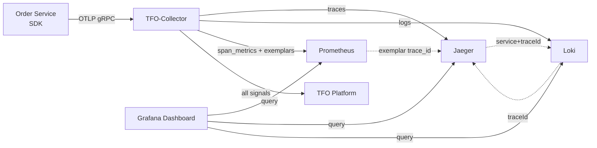
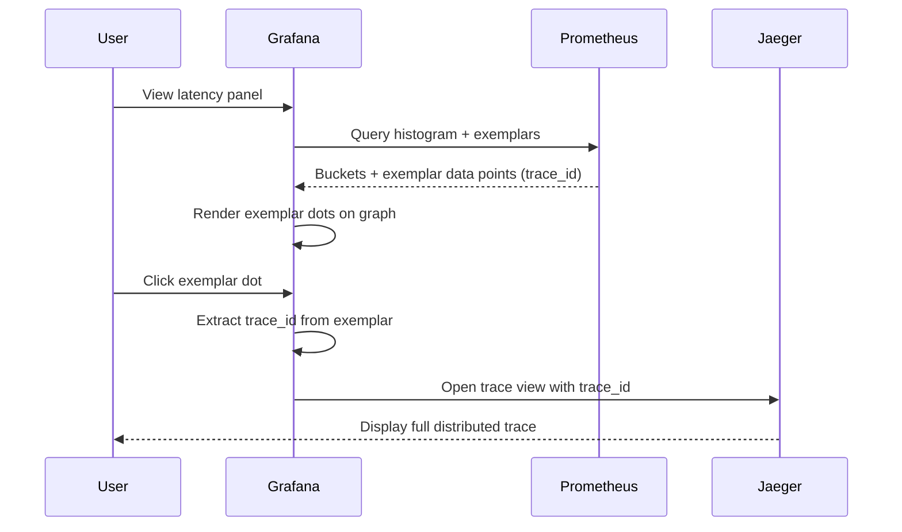

# Grafana Dashboards

This document covers the Grafana dashboard provisioning, the unified monitoring stack (metrics + logs + traces), panel configuration, and exemplar/traceId correlation for the Order Service.

---

## Overview

The Order Service ships a **full observability stack** under the `monitoring` Docker Compose profile: Grafana + Prometheus + Jaeger + Loki, fed by the TFO-Collector. Three datasources are auto-provisioned and wired for cross-signal correlation so a single dashboard can answer *is it healthy?*, *where is the bottleneck?*, and *what do the logs say?* — all linked by `trace_id`.

### Unified correlation dashboard

**Dashboard file:** `configs/grafana/dashboards/order_service_overview.json` (UID: `order-service-overview`)

A single board correlating **metrics + logs + traces**:

| Section           | Signal         | Correlation mechanism                                  |
| ----------------- | -------------- | ------------------------------------------------------ |
| Service Health    | Metrics (RED)  | Exemplar dots → Jaeger trace                           |
| Throughput/Errors | Metrics        | Exemplar dots → Jaeger trace                           |
| Latency Profile   | Metrics        | P50/P95/P99 exemplars → Jaeger trace                   |
| Slow Spans        | Metrics/Traces | Per-span exemplars → Jaeger trace                      |
| Dependencies      | Traces         | Service-graph connector (`traces_service_graph_*`)     |
| Correlated Logs   | Logs (Loki)    | `traceId` structured metadata → Jaeger (derived field) |

### Correlation flows



- **metrics → traces**: Prometheus exemplars carry `trace_id`; configured in `exemplarTraceIdDestinations`.
- **logs → traces**: Loki stores `traceId` as structured metadata; the datasource `derivedFields` makes each log's traceId clickable.
- **traces → logs**: Jaeger `tracesToLogsV2` jumps from a span into Loki filtered by `service.name` + `traceId`.

---

## Running the monitoring stack

```bash
# Start the full observability layer (db optional, only needed by the app)
docker compose --profile monitoring up -d
```

| Service     | URL                       | Purpose                                  |
| ----------- | ------------------------- | ---------------------------------------- |
| Grafana     | http://localhost:3001     | Dashboards (admin / admin)               |
| Prometheus  | http://localhost:9090     | Metrics + span_metrics exemplars         |
| Jaeger UI   | http://localhost:16686    | Distributed traces                       |
| Loki        | http://localhost:3100     | Log aggregation (OTLP native)            |
| Alertmanager| http://localhost:9093     | Alert routing                            |

Datasources (Prometheus, Jaeger, Loki) and the dashboards are **auto-provisioned** on first boot from `configs/grafana/provisioning/`. No manual import is required.

### Collector fan-out

The TFO-Collector (`configs/otel/tfo-collector.yaml`) fans each signal out to multiple backends:

| Pipeline               | Exporters                                                |
| ---------------------- | -------------------------------------------------------- |
| `traces`               | `tfo` (platform), `otlphttp/jaeger`, span_metrics, service_graph |
| `metrics`              | `tfo`, `prometheus` (scraped at `:8889`)                 |
| `metrics/span_metrics` | `tfo`, `prometheus` (with **exemplars**)                 |
| `metrics/service_graph`| `tfo`, `prometheus`                                      |
| `logs`                 | `tfo` (platform), `otlphttp/loki`                        |

The `prometheus` exporter on port `8889` is the bridge that exposes span_metrics/service_graph histograms **with exemplars** for Prometheus to scrape — this is what makes metrics → traces drill-down work.

---

## P95 Latency dashboard (legacy)

**Dashboard file:** `configs/grafana/dashboards/order_service_p95.json`

A focused single-panel board showing P95 latency per route with exemplar overlay. It is retained for lightweight deployments that only run Prometheus + a trace backend. Variables `DS_PROMETHEUS` and `DS_TRACES` are bound at import time.

---

## Dashboard variables (unified board)

| Variable      | Type  | Source                                                                  |
| ------------- | ----- | ----------------------------------------------------------------------- |
| `service_name`| Query | `label_values(traces_calls_total, service_name)`           |
| `http_route`  | Query | `label_values(traces_calls_total{service_name=...}, http_route)` (multi-select + All) |

---

## Exemplar Drill-Down



Exemplar → trace routing is configured once in the datasource (`configs/grafana/provisioning/datasources/datasources.yaml`):

```yaml
jsonData:
  exemplarTraceIdDestinations:
    - name: trace_id
      datasourceUid: jaeger
```

---

## Threshold Lines

| Threshold   | Color  | Meaning                                                   |
| ----------- | ------ | --------------------------------------------------------- |
| 0 – 300ms   | Green  | Healthy latency                                           |
| 300 – 500ms | Orange | Elevated latency (investigate)                            |
| > 500ms     | Red    | Alert threshold (HighP95Latency fires at 500ms sustained) |

---

## Customization

### Adding panels

Extend `configs/grafana/dashboards/order_service_overview.json`. Since the dashboard provider sets `allowUiUpdates: true`, edits made in the Grafana UI are persisted; to keep changes in Git, export the JSON back to the file.

### Switching the trace backend

The Jaeger datasource can be swapped for **Tempo** by changing the datasource `type` to `tempo` (same uid `jaeger` or update the dashboard references). Exemplar correlation works identically.

### Promoting more Loki labels

`configs/loki/loki.yaml` promotes `service.name`, `service.namespace`, `deployment.environment`, and `service.version` to stream labels via `otlp_resource_attributes`. Add more attributes there to enable additional log stream selectors.

---

## Related Pages

- [Observability](Observability.md) — Telemetry pipeline and exemplar flow
- [Alerting](Alerting.md) — Alert rules that correspond to dashboard thresholds
- [Docker Compose](Docker-Compose.md) — Service deployment including the monitoring profile

