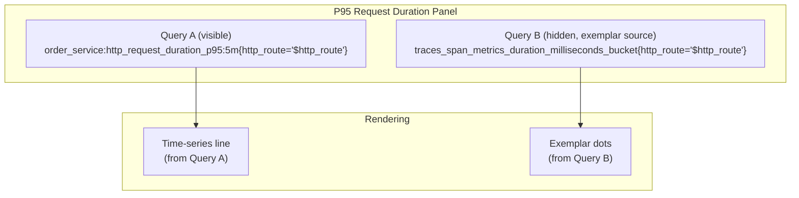
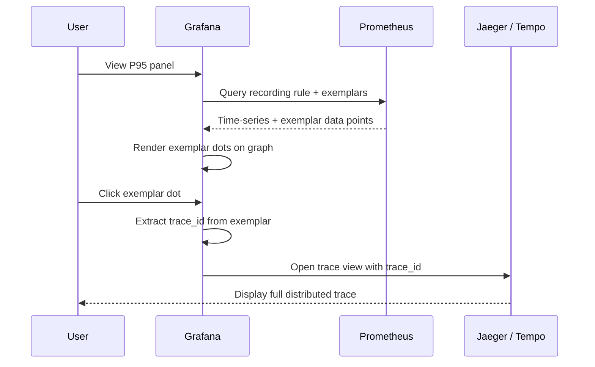

# Grafana Dashboards

This document covers the Grafana dashboard provisioning, panel configuration, exemplar drill-down setup, and usage for the Order Service.

---

## Overview

The Order Service provides a portable Grafana dashboard JSON file that displays P95 latency with exemplar-based trace drill-down. The dashboard can be imported into any Grafana instance (standalone, TFO-Viz, or Grafana Cloud).

**Dashboard file:** `configs/grafana/dashboards/order_service_p95.json`

---

## Dashboard: Order Service — P95 Latency

### Features

- P95 request duration time-series with threshold lines (300ms warning, 500ms critical)
- Exemplar overlay dots from raw histogram data
- Click-through from exemplar dots to trace view (Jaeger or Tempo)
- Route selector variable for filtering by endpoint
- Legend with last, max, and mean values

### Variables

| Variable        | Type       | Purpose                                                                                                     |
| --------------- | ---------- | ----------------------------------------------------------------------------------------------------------- |
| `DS_PROMETHEUS` | Datasource | Prometheus instance for metrics queries                                                                     |
| `DS_TRACES`     | Datasource | Trace backend (Jaeger or Tempo) for exemplar drill-down                                                     |
| `http_route`    | Query      | Endpoint filter populated from `label_values(traces_span_metrics_duration_milliseconds_bucket, http_route)` |

### Panel Queries



- **Query A** — Visible line: P95 from the recording rule
- **Query B** — Hidden series (data source for exemplar dots only): raw histogram buckets

Both queries have `exemplar: true` enabled.

---

## Importing the Dashboard

### Option 1: Grafana UI Import

1. Open Grafana → Dashboards → Import
2. Upload `configs/grafana/dashboards/order_service_p95.json`
3. Select your Prometheus datasource for `DS_PROMETHEUS`
4. Select your trace datasource (Jaeger/Tempo) for `DS_TRACES`
5. Click Import

### Option 2: Grafana Provisioning

Add to your Grafana provisioning config:

```yaml
# /etc/grafana/provisioning/dashboards/order-service.yml
apiVersion: 1
providers:
  - name: "Order Service"
    orgId: 1
    folder: "Order Service"
    type: file
    disableDeletion: false
    editable: true
    options:
      path: /var/lib/grafana/dashboards/order-service
      foldersFromFilesStructure: false
```

Then mount the dashboard JSON into `/var/lib/grafana/dashboards/order-service/`.

---

## Exemplar Drill-Down

### How It Works



### Configuration in Dashboard JSON

The exemplar link is configured in the panel's field config:

```json
{
  "links": [
    {
      "datasource": {
        "type": "${DS_TRACES}",
        "uid": "${DS_TRACES}"
      },
      "field": "trace_id",
      "internal": true,
      "title": "View Trace",
      "type": "trace"
    }
  ]
}
```

This tells Grafana to:

1. Read the `trace_id` field from the exemplar data point
2. Open the trace datasource (`DS_TRACES`) with that `trace_id`
3. Navigate to the trace detail view

---

## Threshold Lines

The panel displays visual threshold lines:

| Threshold   | Color  | Meaning                                                   |
| ----------- | ------ | --------------------------------------------------------- |
| 0 – 300ms   | Green  | Healthy latency                                           |
| 300 – 500ms | Orange | Elevated latency (investigate)                            |
| > 500ms     | Red    | Alert threshold (HighP95Latency fires at 500ms sustained) |

---

## Route Selection

The `http_route` variable allows switching between endpoints:

| Route                       | Description                    |
| --------------------------- | ------------------------------ |
| `/api/v1/orders`            | Create/list orders (default)   |
| `/api/v1/orders/{id}`       | Get/update/delete single order |
| `/api/v1/orders/{id}/items` | Order items sub-resource       |
| `/health`                   | Health check                   |
| `/ready`                    | Readiness check                |
| `/`                         | Root endpoint                  |

The variable is auto-populated from Prometheus label values, so new endpoints appear automatically once instrumented.

---

## Customization

### Adding More Panels

To extend the dashboard, add panels to the `panels` array in the JSON file. Common additions:

- **Request rate** — `sum(rate(traces_span_metrics_calls_total{http_route="$http_route"}[5m])) by (http_status_code)`
- **Error rate** — `sum(rate(traces_span_metrics_calls_total{http_status_code=~"5.."}[5m])) / sum(rate(traces_span_metrics_calls_total[5m]))`
- **P50 latency** — Create another recording rule with `histogram_quantile(0.50, ...)`

### Changing the Trace Datasource

The `DS_TRACES` variable supports:

- **Jaeger** — Set type to `jaeger`
- **Tempo** — Set type to `tempo`
- **Zipkin** — Modify the variable query to `zipkin`

---

## Related Pages

- [Observability](Observability.md) — Telemetry pipeline and exemplar flow
- [Alerting](Alerting.md) — Alert rules that correspond to dashboard thresholds
- [Docker Compose](Docker-Compose.md) — Service deployment including Prometheus
