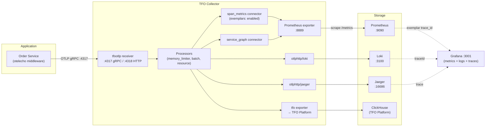
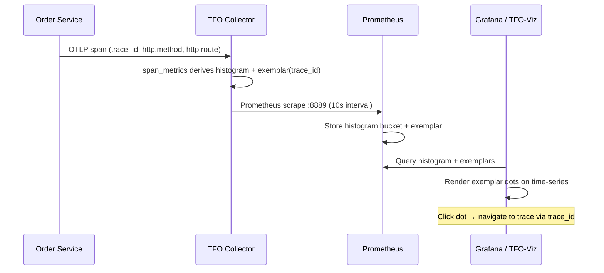

# Observability

This document describes the telemetry pipeline, instrumentation strategy, metrics, traces, exemplars, and data flow for the Order Service.

---

## Overview

The Order Service uses **OpenTelemetry** for distributed tracing, span-derived metrics, and structured logs. Telemetry flows through the TFO Collector, which fans each signal out to queryable OSS backends (Prometheus, Jaeger, Loki) and the TFO Platform. The Collector derives histogram metrics with exemplars and indexes logs with `traceId`, enabling end-to-end click-through from a metric sample → trace → log line in a single Grafana dashboard.

---

## Telemetry Signals

| Signal            | Instrumentation                                           | Export Path                                         | Storage                                |
| ----------------- | --------------------------------------------------------- | --------------------------------------------------- | -------------------------------------- |
| **Traces**        | `otelecho` middleware (auto)                              | App → OTLP gRPC → Collector → Jaeger + TFO Platform | Jaeger (Badger) + ClickHouse (30 days) |
| **Metrics**       | Span-derived histograms via `span_metrics` connector      | Collector → Prometheus exporter (:8889) → scrape    | Prometheus TSDB (90 days)              |
| **Logs**          | Structured JSON (`LOG_FORMAT=json`)                       | App → OTLP → Collector → Loki + TFO Platform        | Loki (7 days) + ClickHouse (30 days)   |
| **Exemplars**     | Attached to histogram buckets by `span_metrics` connector | Collector → Prometheus scrape                       | Prometheus circular buffer (7 days)    |
| **Service graph** | Derived from traces by `service_graph` connector          | Collector → Prometheus exporter (:8889) → scrape    | Prometheus TSDB                        |

---

## Telemetry Pipeline



---

## Exemplar Flow

Exemplars enable navigating from a metric data point directly to the trace that produced it:



### Verification

You can verify exemplars are flowing correctly:

```bash
# Query Prometheus exemplars API
curl "http://localhost:9090/api/v1/query_exemplars?query=traces_duration_milliseconds_bucket&start=$(date -v-1H +%s)&end=$(date +%s)" | jq '.data'
```

The response should include exemplar objects with a `trace_id` label (32-character hex string).

---

## Metric Schema

| Metric Name                                  | Type                   | Unit | Labels                                          | Source                    |
| -------------------------------------------- | ---------------------- | ---- | ----------------------------------------------- | ------------------------- |
| `traces_duration_milliseconds`               | Histogram              | ms   | `http_method`, `http_route`, `http_status_code` | span_metrics connector    |
| `traces_calls_total`                         | Counter                | —    | `http_method`, `http_route`, `http_status_code` | span_metrics connector    |
| `order_service:http_request_duration_p95:5m` | Gauge (recording rule) | ms   | `http_method`, `http_route`                     | Prometheus recording rule |

### Histogram Bucket Bounds

```
[1ms, 5ms, 10ms, 25ms, 50ms, 100ms, 250ms, 500ms, 1s, 2.5s, 5s, 10s]
```

These are configured in the `span_metrics` connector. The 500ms bucket boundary aligns with the P95 alert threshold for precise quantile calculation.

### Cardinality Budget

```
http_method:      5 distinct values (GET, POST, PUT, PATCH, DELETE)
http_status_code: 8 distinct values (200, 201, 400, 401, 403, 404, 422, 500)
http_route:       6 distinct values (template-based routes)

Label combinations: 5 × 8 × 6 = 240
Histogram expansion: 240 × 14 (12 buckets + sum + count) = 3,360 raw series
Recording rule output: 5 × 6 = 30 series
```

### Forbidden Labels

The following are **never** used as metric labels (they may only appear as span attributes):

- `order_id`, `customer_id`, `user_id`, `session_id`
- `trace_id`, `span_id`, `request_id`
- Email addresses, IP addresses, UUIDs, timestamps, free-text fields

---

## Span Attributes

The `otelecho` middleware automatically captures these span attributes:

| Attribute          | Example                               | Notes                              |
| ------------------ | ------------------------------------- | ---------------------------------- |
| `http.method`      | `POST`                                | HTTP method                        |
| `http.route`       | `/api/v1/orders`                      | Route template (not resolved path) |
| `http.status_code` | `201`                                 | Response status code               |
| `http.url`         | `http://localhost:8080/api/v1/orders` | Full request URL                   |
| `http.target`      | `/api/v1/orders`                      | Request target                     |
| `net.host.name`    | `localhost`                           | Server hostname                    |
| `net.host.port`    | `8080`                                | Server port                        |

High-cardinality values (order IDs, customer IDs) are safe as span attributes because spans are sampled and stored with bounded retention.

---

## Collector Configuration

The TFO Collector uses two configuration variants:

| Config          | File                                     | Use Case                                   |
| --------------- | ---------------------------------------- | ------------------------------------------ |
| Full (Platform) | `configs/otel/tfo-collector.yaml`        | Production with TFO Platform backend       |
| Simple (Local)  | `configs/otel/tfo-collector.simple.yaml` | Local development with Prometheus + Jaeger |

### Key Connector: span_metrics

```yaml
connectors:
  span_metrics:
    histogram:
      explicit:
        buckets:
          [1ms, 5ms, 10ms, 25ms, 50ms, 100ms, 250ms, 500ms, 1s, 2.5s, 5s, 10s]
    dimensions:
      - name: http.method
      - name: http.status_code
      - name: http.route
    exemplars:
      enabled: true
    namespace: traces
    metrics_flush_interval: 15s
```

---

## Environment Variables

| Variable                        | Purpose                              | Default              |
| ------------------------------- | ------------------------------------ | -------------------- |
| `TELEMETRYFLOW_ENDPOINT`        | Collector gRPC endpoint              | `tfo-collector:4317` |
| `TELEMETRYFLOW_SERVICE_NAME`    | Service name in traces               | `Order-Service`      |
| `TELEMETRYFLOW_SERVICE_VERSION` | Service version in traces            | `1.4.4`              |
| `TELEMETRYFLOW_INSECURE`        | Disable TLS for collector connection | `true`               |
| `TELEMETRYFLOW_API_KEY_ID`      | API key for v2 endpoints             | —                    |
| `TELEMETRYFLOW_API_KEY_SECRET`  | API secret for v2 endpoints          | —                    |

---

## Retention Policy

| Signal     | Retention | Storage                    |
| ---------- | --------- | -------------------------- |
| Metrics    | 90 days   | Prometheus TSDB            |
| Traces     | 30 days   | ClickHouse (TFO Platform)  |
| Traces     | ephemeral | Jaeger (Badger, demo)      |
| Logs       | 30 days   | ClickHouse (TFO Platform)  |
| Logs       | 7 days    | Loki (filesystem)          |
| Exemplars  | 7 days    | Prometheus circular buffer |
| Audit logs | 365 days  | TFO Platform               |

---

## Instrumentation Overhead

Target: **< 3% p95 latency overhead** from telemetry instrumentation. The `otelecho` middleware adds minimal overhead because:

- Span creation is non-blocking
- Batch processor buffers spans (200ms flush interval)
- Memory limiter prevents OOM under load

---

## Related Pages

- [Architecture](Architecture.md) — System design and infrastructure topology
- [Alerting](Alerting.md) — Alert rules and Alertmanager configuration
- [Grafana Dashboards](Grafana-Dashboards.md) — Unified metrics + logs + traces correlation dashboard
- [Troubleshooting](Troubleshooting.md) — Diagnosing telemetry issues
