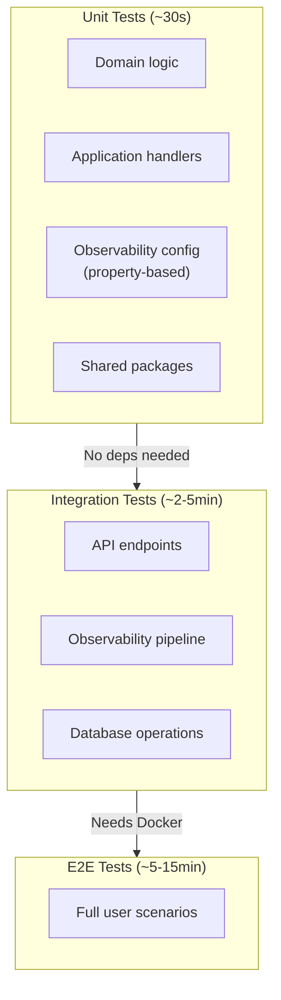
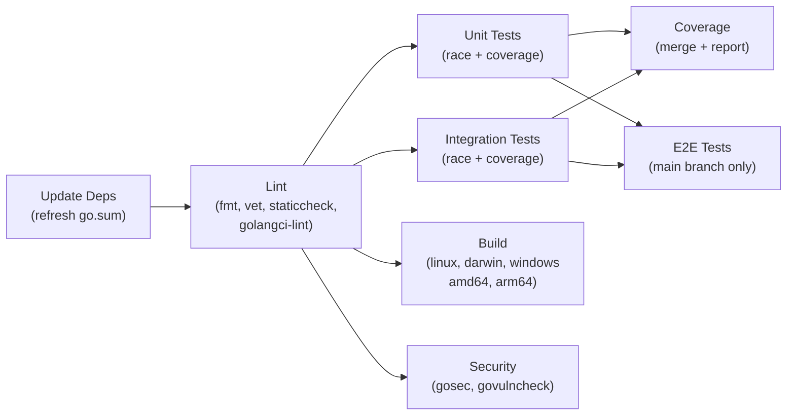

# Running Tests

This guide provides detailed instructions for running every type of test in the Order Service — from quick unit tests to full-stack integration tests.

---

## Quick Reference

```bash
# Run everything
make test

# Just unit tests (fast, no dependencies)
make test-unit

# Just integration tests (needs Docker services)
make test-integration

# E2E tests (needs full stack running)
make test-e2e

# Coverage report
make test-coverage
```

---

## Test Execution Flow



---

## Unit Tests

Unit tests are fast, isolated, and require no external services.

### Run All Unit Tests

```bash
make test-unit
# or directly:
go test -v -timeout 5m ./tests/unit/...
```

### Run Specific Packages

```bash
# Domain tests only
go test -v ./tests/unit/domain/...

# Application handler tests
go test -v ./tests/unit/application/...

# Observability configuration tests (property-based)
go test -v ./tests/unit/observability/...

# Telemetry tests
go test -v ./tests/unit/telemetry/...
```

### Run a Single Test

```bash
# By test name (regex match)
go test -v -run TestHighCardinalityLabels ./tests/unit/observability/...

# By test file (run all tests in a file's package, filtered)
go test -v -run "TestRecordingRule" ./tests/unit/observability/...
```

### Property-Based Tests

Property-based tests use [`pgregory.net/rapid`](https://github.com/flyingmutant/rapid) to generate random inputs:

```bash
# All property tests
go test -v -run "TestProperty\|TestCardinality\|TestRecording\|TestAbsent" ./tests/unit/observability/...

# With increased iterations (default: 100)
go test -v -rapid.checks=500 ./tests/unit/observability/...
```

| Test | What It Verifies | Min Iterations |
|------|------------------|----------------|
| Cardinality test | No metric label contains UUID, trace_id, or email | 100 |
| Recording rule test | Output labels exclude `le` bucket label | 100 |
| Alert rule test | Absent metric produces no alert | 100 |

---

## Integration Tests

Integration tests verify components work together. They may require Docker services.

### Prerequisites

```bash
# Start the monitoring stack for observability tests
docker compose --profile monitoring up -d

# Wait for services to be healthy
docker compose --profile monitoring ps
```

### Run All Integration Tests

```bash
make test-integration
# or directly:
go test -v -timeout 5m ./tests/integration/...
```

### Run Observability Integration Tests

```bash
go test -v -timeout 5m ./tests/integration/observability/...
```

### Individual Observability Tests

```bash
# Prometheus rules load correctly
go test -v -run TestRulesValidation ./tests/integration/observability/...

# Alert fires and is received by Alertmanager
go test -v -run TestAlertmanagerAlert ./tests/integration/observability/...

# Exemplar end-to-end flow
go test -v -run TestExemplarFlow ./tests/integration/observability/...

# Alertmanager health check
go test -v -run TestAlertmanagerSmoke ./tests/integration/observability/...

# Prometheus hot-reload
go test -v -run TestPrometheusReload ./tests/integration/observability/...

# Recording rule produces P95 within 30s
go test -v -run TestRecordingRuleEval ./tests/integration/observability/...

# Absent histogram produces no series
go test -v -run TestAbsentMetric ./tests/integration/observability/...

# Invalid rules file rejected
go test -v -run TestInvalidRules ./tests/integration/observability/...

# Alert fires, has correct annotations, and resolves
go test -v -run TestAlertResolution ./tests/integration/observability/...
```

### API Integration Tests

```bash
# Requires database
docker compose --profile db up -d

go test -v -timeout 5m ./tests/integration/api_test.go ./tests/integration/order_api_test.go
```

---

## E2E Tests

End-to-end tests run against the full stack.

### Setup

```bash
# Start everything
docker compose --profile all up -d

# Wait for all services to be healthy
docker compose --profile all ps

# Verify API is up
curl http://localhost:8080/health
```

### Run

```bash
make test-e2e
# or:
go test -v -timeout 10m ./tests/e2e/...
```

---

## CI Mode (Race Detection + Coverage)

CI mode enables the race detector and produces coverage artifacts:

```bash
# Unit tests with race detection
make test-unit-ci
# Equivalent: go test -v -race -timeout 5m -coverprofile=coverage-unit.out -covermode=atomic ./tests/unit/...

# Integration tests with race detection
make test-integration-ci
# Equivalent: go test -v -race -timeout 10m -coverprofile=coverage-integration.out -covermode=atomic ./tests/integration/...

# Full CI pipeline (lint + test + build)
make ci
```

---

## Coverage

### Generate Coverage

```bash
# Run tests with coverage profiles
make test-unit
make test-integration

# Merge coverage files
make coverage-merge

# Generate HTML report
make coverage-report
```

### View Coverage

```bash
# Terminal summary
go tool cover -func=coverage-merged.out

# HTML report (opens in browser)
go tool cover -html=coverage-merged.out -o coverage.html
open coverage.html
```

### Coverage Files

| File | Description |
|------|-------------|
| `coverage-unit.out` | Unit test coverage data |
| `coverage-integration.out` | Integration test coverage data |
| `coverage-merged.out` | Combined coverage |
| `coverage.html` | Visual HTML report |
| `coverage-summary.txt` | Text summary with per-function breakdown |

---

## Benchmarks

```bash
# Run all benchmarks
make bench

# Specific package benchmarks
go test -bench=. -benchmem ./tests/unit/domain/...

# Compare benchmarks (requires benchstat)
go test -bench=. -count=5 ./tests/unit/domain/... > old.txt
# ... make changes ...
go test -bench=. -count=5 ./tests/unit/domain/... > new.txt
benchstat old.txt new.txt
```

---

## Test Configuration

### Environment Variables for Tests

| Variable | Default | Purpose |
|----------|---------|---------|
| `DB_HOST` | `localhost` | Database host for integration tests |
| `DB_PORT` | `5432` | Database port |
| `DB_USER` | `postgres` | Database user |
| `DB_PASSWORD` | `postgres` | Database password |
| `DB_NAME` | `orders_test` | Test database name |
| `DB_SSL_MODE` | `disable` | TLS mode |

### Test Tags

Some tests use build tags for conditional compilation:

```go
//go:build integration

package observability_test
```

These tests are included by default when running with `go test ./tests/integration/...` since Go 1.17+ includes all build tags matching the test directory.

---

## Validating Configuration Files

### Prometheus Rules

```bash
# Using Docker (no local promtool needed)
docker run --rm \
  -v $(pwd)/configs/prometheus/rules:/rules \
  prom/prometheus:v3.4.0 \
  promtool check rules /rules/order_service.yml

# Or if promtool is installed locally
promtool check rules configs/prometheus/rules/order_service.yml
```

### Docker Compose

```bash
# Validate compose file syntax
docker compose config > /dev/null
```

### YAML Syntax

```bash
# Quick YAML validation
python3 -c "import yaml; yaml.safe_load(open('configs/prometheus/rules/order_service.yml'))"
python3 -c "import yaml; yaml.safe_load(open('configs/alertmanager/alertmanager.yml'))"
python3 -c "import yaml; yaml.safe_load(open('configs/prometheus/prometheus.yml'))"
```

### Grafana Dashboard JSON

```bash
# Validate JSON syntax
python3 -m json.tool configs/grafana/dashboards/order_service_p95.json > /dev/null
```

---

## Troubleshooting Tests

### Tests Fail with "connection refused"

The integration tests require running services:

```bash
# Check services are running
docker compose --profile monitoring ps

# Restart if needed
docker compose --profile monitoring restart

# Check specific service logs
docker compose logs prometheus
docker compose logs alertmanager
```

### Property Tests Fail Intermittently

Property-based tests are probabilistic. If they fail:

```bash
# Run with more iterations to confirm
go test -v -rapid.checks=1000 -run TestCardinality ./tests/unit/observability/...

# Get the seed for reproduction
# (rapid prints the seed on failure, use it to reproduce)
go test -v -rapid.seed=<seed-from-output> -run TestCardinality ./tests/unit/observability/...
```

### Race Conditions

```bash
# Run with race detector to catch data races
go test -race -timeout 5m ./tests/unit/...
```

### Timeout Issues

```bash
# Increase timeout for slow environments
go test -v -timeout 10m ./tests/integration/...

# Skip long-running tests locally
make test-short
```

---

## CI/CD Pipeline

The CI workflow (`.github/workflows/ci.yml`) runs on every push and PR:



### Trigger Conditions

| Event | Branches | Tests Run |
|-------|----------|-----------|
| Push | main, develop, feature/*, release/* | Lint + Unit + Integration + Build + Security |
| PR | main, develop | Lint + Unit + Integration + Build + Security |
| Push to main | main | All of the above + E2E |
| Manual dispatch | any | Configurable (can enable E2E, skip lint) |

---

## Summary of Make Targets

| Command | What It Does | Speed |
|---------|-------------|-------|
| `make test` | Unit + Integration | ~3 min |
| `make test-unit` | Unit tests only | ~30s |
| `make test-integration` | Integration tests | ~2-5 min |
| `make test-e2e` | End-to-end tests | ~5-15 min |
| `make test-all` | Unit + Integration + E2E | ~10-20 min |
| `make test-short` | Skip long-running tests | ~1 min |
| `make test-coverage` | Generate HTML coverage | ~30s |
| `make bench` | Run benchmarks | ~1-2 min |
| `make check` | fmt + vet + lint + test | ~5 min |
| `make ci` | Full CI pipeline | ~5 min |

---

## Related Pages

- [Testing](Testing.md) — Test suite structure and conventions
- [Getting Started](Getting-Started.md) — Initial setup and prerequisites
- [Troubleshooting](Troubleshooting.md) — General issue resolution
- [Docker Compose](Docker-Compose.md) — Service setup for integration tests
