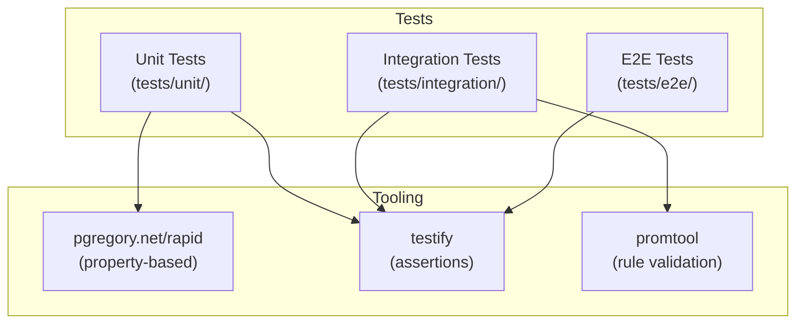
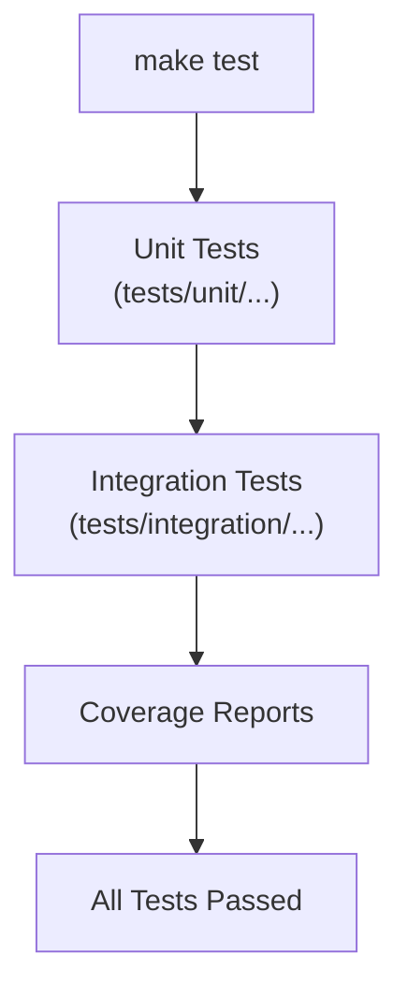
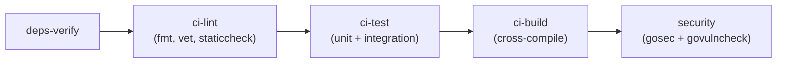

# Testing

This document describes the test suite structure, test categories, how to run tests, and coverage strategy for the Order Service.

---

## Overview

The Order Service uses Go's standard testing framework with these categories:



---

## Directory Structure

```
tests/
├── unit/                           Fast, isolated tests (no external deps)
│   ├── domain/                     Domain entity logic
│   ├── application/                Command/query handler logic
│   ├── infrastructure/             Infrastructure adapters
│   ├── observability/              Observability config validation
│   │   ├── cardinality_test.go     Property: no UUID in metric labels
│   │   ├── recording_rule_test.go  Property: recording rule excludes `le`
│   │   ├── alert_rule_test.go      Property: absent metric → no alert
│   │   ├── dashboard_test.go       Dashboard JSON structure validation
│   │   ├── docker_compose_test.go  Volume mount validation
│   │   ├── alertmanager_config_test.go  Config extensibility
│   │   └── helpers_test.go         Shared test utilities
│   ├── pkg/                        Shared package tests
│   └── telemetry/                  Telemetry helper tests
├── integration/                    Tests requiring running services
│   ├── observability/              Observability pipeline tests
│   │   ├── rules_validation_test.go      Prometheus rules load
│   │   ├── alertmanager_alert_test.go    Alert received by AM
│   │   ├── exemplar_flow_test.go         Exemplar end-to-end
│   │   ├── alertmanager_smoke_test.go    AM health check
│   │   ├── prometheus_reload_test.go     Hot-reload via /-/reload
│   │   ├── recording_rule_eval_test.go   P95 appears within 30s
│   │   ├── absent_metric_test.go         No false series
│   │   ├── invalid_rules_test.go         Invalid YAML rejected
│   │   └── alert_resolution_test.go      Alert fire + resolve
│   ├── api_test.go                 API endpoint integration
│   └── order_api_test.go           Order CRUD integration
├── e2e/                            Full stack end-to-end
├── fixtures/                       Test data and fixtures
└── mocks/                          Mock implementations
```

---

## Test Categories

### Unit Tests (`tests/unit/`)

Fast tests that validate logic in isolation. No network calls, no databases, no containers.

**Includes:**

- Domain entity behavior
- Command/query handler logic
- Configuration validation (YAML/JSON parsing)
- Property-based tests (cardinality, rule correctness)

**Run time:** < 30 seconds

### Integration Tests (`tests/integration/`)

Tests that verify components work together. May require running containers (Prometheus, Alertmanager, Collector).

**Includes:**

- Prometheus rule loading and evaluation
- Alert firing and resolution
- Exemplar end-to-end pipeline
- Service health checks
- API endpoint behavior with database

**Run time:** 1–5 minutes

### End-to-End Tests (`tests/e2e/`)

Full-stack tests simulating real user scenarios through the complete pipeline.

**Run time:** 5–15 minutes

---

## Property-Based Tests

Property-based tests use [`pgregory.net/rapid`](https://github.com/flyingmutant/rapid) to generate random inputs and verify invariants hold across all cases.

### Property 1: No High-Cardinality Metric Labels

```go
// tests/unit/observability/cardinality_test.go
// Generates random label values and asserts none match:
// - UUID pattern: [0-9a-f]{8}-[0-9a-f]{4}-...-[0-9a-f]{12}
// - 32-char hex (trace_id/span_id format)
// - Email pattern (contains @)
```

**Validates:** Steering §2 (Cardinality hard constraints)

### Property 2: Recording Rule Excludes `le` Label

```go
// tests/unit/observability/recording_rule_test.go
// Parses the recording rule expression and verifies:
// - Output contains http_method and http_route
// - Output does NOT contain le
```

**Validates:** Requirement R1.2

### Property 3: Absent Metric Produces No Alert

```go
// tests/unit/observability/alert_rule_test.go
// Generates random method/route combinations with zero samples
// Verifies the alert expression evaluates to empty
```

**Validates:** Requirement R2.5

---

## Running Tests

### Quick Commands

```bash
# All tests (unit + integration)
make test

# Unit tests only
make test-unit

# Integration tests only
make test-integration

# E2E tests
make test-e2e

# With coverage
make test-coverage

# Short mode (skip long-running tests)
make test-short

# Benchmarks
make bench
```

### Direct Go Commands

```bash
# Unit tests with verbose output
go test -v -timeout 5m ./tests/unit/...

# Specific test package
go test -v ./tests/unit/observability/...

# Single test function
go test -v -run TestHighCardinalityLabels ./tests/unit/observability/...

# Integration tests
go test -v -timeout 5m ./tests/integration/...

# With race detector (CI mode)
go test -v -race -timeout 5m -coverprofile=coverage.out ./tests/unit/...
```

### CI Pipeline

```bash
# Full CI lint + test + build
make ci

# Individual CI steps
make ci-lint              # fmt-check + vet + staticcheck + lint
make ci-test              # unit + integration with race detection
make ci-build             # Cross-platform build verification
```

---

## Test Execution Flow



### CI Pipeline Flow



---

## Coverage

### Generating Reports

```bash
# Run tests with coverage
make test-unit
make test-integration

# Generate HTML reports
make test-coverage

# Merge coverage files (requires gocovmerge)
make coverage-merge

# View coverage summary
make coverage-report
```

### Coverage Files

| File                       | Source                    |
| -------------------------- | ------------------------- |
| `coverage-unit.out`        | Unit test coverage        |
| `coverage-integration.out` | Integration test coverage |
| `coverage-merged.out`      | Combined coverage         |
| `coverage.html`            | HTML report               |

---

## Writing New Tests

### Conventions

- Test files end with `_test.go`
- Test functions start with `Test`
- Property tests use `rapid.Check(t, func(t *rapid.T) { ... })`
- Use `testify/assert` for assertions
- Place test helpers in `helpers_test.go` within the same package

### Test Tags

For tests requiring specific infrastructure:

```go
//go:build integration
// +build integration

package observability_test
```

### Fixtures

Place test data in `tests/fixtures/`:

```
tests/fixtures/
├── valid_rules.yml          # Valid Prometheus rules
├── invalid_rules.yml        # Malformed YAML for error testing
├── sample_histogram.json    # Sample metric data
└── sample_trace.json        # Sample trace span
```

---

## Related Pages

- [Observability](Observability.md) — What the observability tests validate
- [Alerting](Alerting.md) — Alert rules tested by integration tests
- [Docker Compose](Docker-Compose.md) — Infrastructure required for integration tests
