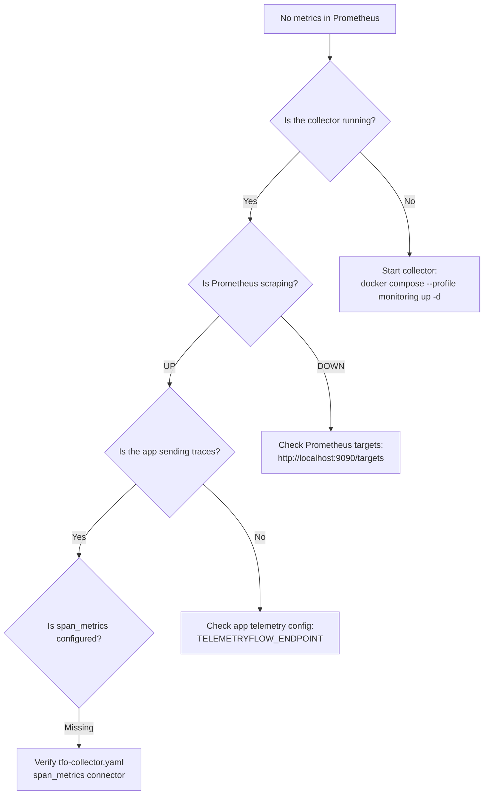

# Troubleshooting

This document provides diagnosis steps and resolution guidance for common issues with the Order Service and its observability stack.

---

## Quick Health Check

```bash
# Check all services
curl http://localhost:8080/health         # API
curl http://localhost:9090/-/healthy       # Prometheus
curl http://localhost:9093/-/healthy       # Alertmanager
curl http://localhost:13133               # TFO Collector
```

---

## Common Issues

### 1. No Metrics in Prometheus

**Symptom:** Prometheus shows no data for `traces_duration_milliseconds`.



**Diagnosis steps:**

```bash
# 1. Check collector is running and healthy
docker compose ps tfo-collector
curl http://localhost:13133

# 2. Check Prometheus scrape targets
# Open http://localhost:9090/targets — look for otel-collector job

# 3. Check collector metrics endpoint directly
curl http://localhost:8889/metrics | grep traces_span_metrics

# 4. Check app is sending traces
docker compose logs api | grep -i "otel\|telemetry\|trace"

# 5. Send a test request to generate a trace
curl -X POST http://localhost:8080/api/v1/orders \
  -H "Content-Type: application/json" \
  -d '{"customer_id": "test", "items": []}'
```

---

### 2. Exemplars Not Appearing

**Symptom:** Prometheus has metrics but `/api/v1/query_exemplars` returns empty.

**Diagnosis:**

```bash
# 1. Verify exemplar-storage feature is enabled
docker compose exec prometheus cat /proc/1/cmdline | tr '\0' '\n' | grep exemplar
# Should show: --enable-feature=exemplar-storage

# 2. Check collector span_metrics has exemplars enabled
grep -A2 "exemplars:" configs/otel/tfo-collector.yaml
# Should show: enabled: true

# 3. Check collector metrics for exemplar data
curl -s http://localhost:8889/metrics | grep "# HELP traces_span_metrics"
# Look for TYPE histogram (exemplars attach to histograms)

# 4. Query exemplars API
curl "http://localhost:9090/api/v1/query_exemplars?query=traces_duration_milliseconds_bucket&start=$(date -v-1H +%s)&end=$(date +%s)" | jq '.data | length'
```

**Common causes:**

- `exemplars.enabled: false` in collector config
- Prometheus started without `--enable-feature=exemplar-storage`
- No traffic generated yet (exemplars appear only after requests)
- Exemplar buffer full (7-day retention, circular buffer)

---

### 3. Alerts Not Firing

**Symptom:** P95 is above 500ms but `HighP95Latency` alert is not firing.

**Diagnosis:**

```bash
# 1. Check rules are loaded
curl http://localhost:9090/api/v1/rules | jq '.data.groups[] | select(.name == "order_service_latency") | .rules[].name'

# 2. Check recording rule is producing data
curl "http://localhost:9090/api/v1/query?query=order_service:http_request_duration_p95:5m" | jq '.data.result'

# 3. Check alert state
curl http://localhost:9090/api/v1/alerts | jq '.data.alerts[] | select(.labels.alertname == "HighP95Latency")'

# 4. Check Prometheus can reach Alertmanager
curl "http://localhost:9090/api/v1/alertmanagers" | jq '.data'
```

**Common causes:**

- Rules file not mounted (check `docker compose config` for volume mounts)
- `for: 2m` requires sustained threshold — wait at least 2 minutes
- No traffic for the specific route (recording rule produces nothing)
- Prometheus cannot reach Alertmanager (network issue)

---

### 4. Alertmanager Not Receiving Alerts

**Symptom:** Alert shows `firing` in Prometheus but nothing in Alertmanager.

```bash
# 1. Check Alertmanager is healthy
curl http://localhost:9093/-/healthy

# 2. Check Alertmanager has received alerts
curl http://localhost:9093/api/v2/alerts | jq '. | length'

# 3. Verify Prometheus alertmanager config
curl http://localhost:9090/api/v1/alertmanagers | jq '.data.activeAlertmanagers'

# 4. Check Alertmanager logs
docker compose logs alertmanager | tail -20

# 5. Verify network connectivity
docker compose exec prometheus wget -q -O- http://alertmanager:9093/-/healthy
```

---

### 5. Prometheus Rules Reload Fails

**Symptom:** `POST /-/reload` returns non-200 status.

```bash
# 1. Attempt reload and check response
curl -s -o /dev/null -w "%{http_code}" -X POST http://localhost:9090/-/reload

# 2. Check Prometheus logs for error details
docker compose logs prometheus | grep -i "error\|reload\|rule" | tail -20

# 3. Validate rules file syntax
docker run --rm -v $(pwd)/configs/prometheus/rules:/rules prom/prometheus:v3.4.0 \
  promtool check rules /rules/order_service.yml

# 4. Check YAML syntax
python3 -c "import yaml; yaml.safe_load(open('configs/prometheus/rules/order_service.yml'))"
```

**Common causes:**

- Invalid YAML syntax in rules file
- Invalid PromQL expression
- File not mounted into container (check volumes)
- `--web.enable-lifecycle` flag missing

---

### 6. Container Fails to Start

**Symptom:** Service exits immediately or stays in restart loop.

```bash
# 1. Check container status
docker compose ps -a

# 2. View exit code and logs
docker compose logs <service-name> | tail -50

# 3. Check resource limits
docker stats --no-stream

# 4. Verify config file syntax
docker compose config > /dev/null 2>&1 && echo "Valid" || echo "Invalid"

# 5. Check port conflicts
lsof -i :8080   # API
lsof -i :9090   # Prometheus
lsof -i :9093   # Alertmanager
lsof -i :4317   # Collector gRPC
```

---

### 7. Dashboard Shows "No Data"

**Symptom:** Grafana dashboard panels display "No data".

**Diagnosis:**

```bash
# 1. Check Prometheus datasource is configured in Grafana
# Open Grafana → Configuration → Data Sources

# 2. Verify the metric exists
curl "http://localhost:9090/api/v1/query?query=order_service:http_request_duration_p95:5m" | jq '.data.result | length'

# 3. Check time range — recording rule needs 5 min of data
# Ensure traffic has been flowing for at least 5 minutes

# 4. Verify http_route variable has values
curl "http://localhost:9090/api/v1/label/http_route/values" | jq '.data'
```

**Common causes:**

- No traffic generated yet (need at least 5 min of data for rate window)
- Wrong datasource UID in dashboard
- `http_route` variable has no values (no matching series)
- Time range too narrow

---

### 8. High Memory Usage in Collector

**Symptom:** TFO Collector consuming excessive memory.

```bash
# 1. Check current memory usage
docker stats tfo-collector --no-stream

# 2. Check pprof heap profile
curl http://localhost:1777/debug/pprof/heap > heap.prof
go tool pprof heap.prof

# 3. Check batch queue sizes
curl http://localhost:8888/metrics | grep "otelcol_processor_batch"

# 4. Check memory limiter status
curl http://localhost:8888/metrics | grep "otelcol_processor_refused"
```

**Resolution:**

- Reduce `send_batch_size` in processor config
- Lower `memory_limiter.limit_percentage`
- Reduce `metrics_flush_interval` in span_metrics connector
- Check for cardinality explosion (too many unique label combinations)

---

## Diagnostic Endpoints

| Service      | Endpoint                  | Purpose                         |
| ------------ | ------------------------- | ------------------------------- |
| API          | `GET /health`             | Liveness check                  |
| API          | `GET /ready`              | Readiness check                 |
| Collector    | `GET :13133`              | Health check                    |
| Collector    | `GET :8888/metrics`       | Internal metrics                |
| Collector    | `GET :8889/metrics`       | Exported metrics (span_metrics) |
| Collector    | `GET :55679/debug/tracez` | zPages trace debug              |
| Collector    | `GET :1777/debug/pprof/`  | Go pprof profiling              |
| Prometheus   | `GET /-/healthy`          | Health check                    |
| Prometheus   | `GET /api/v1/rules`       | Loaded rules                    |
| Prometheus   | `GET /api/v1/alerts`      | Active alerts                   |
| Prometheus   | `GET /api/v1/targets`     | Scrape targets                  |
| Prometheus   | `POST /-/reload`          | Hot-reload config               |
| Alertmanager | `GET /-/healthy`          | Health check                    |
| Alertmanager | `GET /api/v2/alerts`      | Received alerts                 |
| Alertmanager | `GET /api/v2/status`      | Configuration status            |

---

## Useful Commands

```bash
# View real-time logs for all monitoring services
docker compose --profile monitoring logs -f

# Check network connectivity between containers
docker compose exec api wget -q -O- http://tfo-collector:13133

# Restart monitoring stack without data loss
docker compose --profile monitoring restart

# Force recreate containers (picks up config changes)
docker compose --profile monitoring up -d --force-recreate

# Export Prometheus data for analysis
curl "http://localhost:9090/api/v1/query?query=up" | jq '.data.result'
```

---

## Related Pages

- [Observability](Observability.md) — Telemetry pipeline and configuration
- [Alerting](Alerting.md) — Alert rules and Alertmanager setup
- [Docker Compose](Docker-Compose.md) — Service configuration and networking
- [Testing](Testing.md) — Integration tests that verify the pipeline
